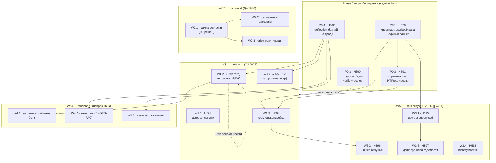

# Implementation map: масштабирование Telegram-интеграции 2026–2027

_Created: 11-07-2026 · Last updated: 30-07-2026_

> **PR/file-level карта исполнения** для зонтичного
> [`ROADMAP_TELEGRAM_SCALING_2026_2027.md`](https://github.com/gasyoun/Systema-Sanscriticum/blob/main/docs/ROADMAP_TELEGRAM_SCALING_2026_2027.md).
> Roadmap отвечает «куда расти и с чего начать»; **эта карта отвечает «какие именно файлы,
> флаги, тесты и хэндофы»** — каждый узел = один PR размером в одну агент-сессию, с
> перечнем затронутых файлов, миграций, конфиг-ключей, тестов, зависимостей, гейта и
> исполнителя. Составлена после чтения кода на `main` (не по прозе roadmap) — три
> расхождения кода и roadmap зафиксированы в §2.
>
> Провенанс: [H565](https://github.com/gasyoun/Uprava/blob/main/handoffs/archive/H565-Opus_Systema-Sanscriticum_telegram_scaling_roadmap_11.07.26.md)
> (roadmap) → эта карта, Opus 4.8 (`claude-opus-4-8`), 11-07-2026. Все 4 @DECIDE roadmap'а
> **уже решены MG** ([PR #453](https://github.com/gasyoun/Systema-Sanscriticum/pull/453), roadmap §8) —
> учтено в гейтах ниже.

---

## 1. Как читать карту

- **Узел** = один PR = один `H###`-хэндоф (где применимо). Столбцы: что делает · файлы ·
  миграции/флаги · тесты · зависит от · гейт · исполнитель.
- **Гейт** — что должно быть истинно до старта. Почти все @DECIDE закрыты (§8 roadmap);
  остаются `prereq` (человек/Иван/прод-доступ) и `D##` (формальный `/decision-record` до
  прод-включения авто-ответа).
- **Исполнитель** — модель-раннер (Opus для судейства/много-поверхностной сверки, Sonnet для
  кодовых PR).
- Пути — полные `blob`-URL на `main`. Слаг в скобках после `H###` совпадает с именем файла
  хэндофа.

---

## 2. Реконсиляция кода и roadmap (проверено на `main`, 11-07-2026)

Три пункта, где текст roadmap опережал или отставал от кода. Карта строится на коде.

| # | Roadmap говорит | Код на `main` | Следствие для узла |
|---|---|---|---|
| R1 | P0.2: `/api/telegram/webhook` **без проверки секрета** (auth-дыра) | [`VerifyTelegramBotWebhook`](https://github.com/gasyoun/Systema-Sanscriticum/blob/main/app/Http/Middleware/VerifyTelegramBotWebhook.php) **уже fail-CLOSED** (пустой секрет → 403), навешен как `verify.tg.bot` на роут ([`routes/api.php`](https://github.com/gasyoun/Systema-Sanscriticum/blob/main/routes/api.php)). VK-твин [`VerifyVkBotWebhook`](https://github.com/gasyoun/Systema-Sanscriticum/blob/main/app/Http/Middleware/VerifyVkBotWebhook.php) тоже fail-closed. Находка [`AUDIT_PLAN.md`](https://github.com/gasyoun/Systema-Sanscriticum/blob/main/AUDIT_PLAN.md) (fail-open, 02-07) **исправлена**. | **P0.2 сжимается** из «добавить проверку» в «подтвердить, что fail-closed-миддлвара задеплоена + `TELEGRAM_BOT_WEBHOOK_SECRET`/`VK_CALLBACK_SECRET` заданы в проде и зеркалированы в `setWebhook`/VK Callback». Кода почти нет — верификация + строка в `DEPLOY_QUEUE.md`. |
| R2 | P0.4: прогнать `support:deflection-report` | Команды **`support:deflection-report` НЕ существует**. Есть [`support:topic-ranking`](https://github.com/gasyoun/Systema-Sanscriticum/blob/main/app/Console/Commands/SupportTopicRanking.php) (`--months=6 --since --until --json`); deflection-метрики живут в [`SupportDailyRollup`](https://github.com/gasyoun/Systema-Sanscriticum/blob/main/app/Models/SupportDailyRollup.php) + `TelegramSupportAnalytics`. | **P0.4 использует реальную команду** `support:topic-ranking --months=6 --json` + чтение `support_daily_rollups`. Имя команды в roadmap — исправить (см. §7). |
| R3 | W1.1: включить флаг `class_link_autopost` | Env-флаг `features.class_link_autopost` — **аварийный рубильник**; фактический гейт — колонка `MarketingSetting.class_link_autopost_enabled`, читается в [`PostClassLinkToGroupChat`](https://github.com/gasyoun/Systema-Sanscriticum/blob/main/app/Console/Commands/PostClassLinkToGroupChat.php) (команда `classes:post-group-link`). | **W1.1 переключает ОБА гейта** (env + admin-тумблер) и требует заполнить `groups.telegram_chat_id` (человек). |

Дополнительно (не расхождение, но факт для узлов): **reply-out полностью проведён в коде** —
[`SupportReplyService`](https://github.com/gasyoun/Systema-Sanscriticum/blob/main/app/Services/Support/SupportReplyService.php) →
[`DeliverSupportReply`](https://github.com/gasyoun/Systema-Sanscriticum/blob/main/app/Jobs/DeliverSupportReply.php) →
[`TelegramSupportSyncService::deliverMessage()`](https://github.com/gasyoun/Systema-Sanscriticum/blob/main/app/Services/TelegramSupport/TelegramSupportSyncService.php)
за флагом `support_unified_reply` + `TELEGRAM_SUPPORT_ENABLED`. W1.3 — это **включение канарейки**, не постройка.

---

## 3. Граф зависимостей (DAG)

Критический путь к дедлайну **01-09-2026** (снятие сезонного пика вопросов): **P0.1 → P0.3 →
W1.3 → W3.2**, параллельно **W1.1** и **W3.3/W3.4**. WS2/WS4 — после.

---

## 4. Phase 0 — узлы

### P0.1 — инвентарь userbot Ивана + единый раннер · H570 · Opus
| | |
|---|---|
| **Что делает** | Иван операционализировал userbot **вне git** (`telegram-userbot/` в [`.gitignore`](https://github.com/gasyoun/Systema-Sanscriticum/blob/main/.gitignore)). Собрать инвентарь: какие демоны крутятся, systemd/supervisor-юниты, каденс cron, какая MadelineProto-сессия, и подтвердить единый раннер. |
| **Файлы** | новый `docs/telegram-userbot-inventory.md` (аудит); свериться с [`Kernel.php`](https://github.com/gasyoun/Systema-Sanscriticum/blob/main/app/Console/Kernel.php) (`telegram-support:sync` в `everyMinute` при `TELEGRAM_SUPPORT_ENABLED=true`), [`MadelineClientFactory`](https://github.com/gasyoun/Systema-Sanscriticum/blob/main/app/Services/Telegram/MadelineClientFactory.php), [`SyncTelegramSupport`](https://github.com/gasyoun/Systema-Sanscriticum/blob/main/app/Console/Commands/SyncTelegramSupport.php) |
| **Миграции/флаги** | нет |
| **Тесты** | нет (аудит-док) |
| **Зависит от** | — (вход) |
| **Гейт** | `prereq`: один вопрос Ивану (что крутит cron; включён ли Laravel-планировщик). **D2 решён**: канонический раннер = cron Ивана запускает `php artisan telegram-support:sync`. |
| **Исполнитель** | Opus (много-поверхностная сверка + переписка) |

### P0.2 — секрет вебхука: verify + deploy · H590 · Sonnet
| | |
|---|---|
| **Что делает** | По R1: миддлвара уже fail-closed. Задача = **подтвердить деплой** fail-closed-версии на прод и что `TELEGRAM_BOT_WEBHOOK_SECRET` + `VK_CALLBACK_SECRET` заданы в проде **и** зеркалированы в `setWebhook(secret_token=…)` / VK Callback settings. |
| **Файлы** | [`VerifyTelegramBotWebhook`](https://github.com/gasyoun/Systema-Sanscriticum/blob/main/app/Http/Middleware/VerifyTelegramBotWebhook.php), [`VerifyVkBotWebhook`](https://github.com/gasyoun/Systema-Sanscriticum/blob/main/app/Http/Middleware/VerifyVkBotWebhook.php), [`config/services.php`](https://github.com/gasyoun/Systema-Sanscriticum/blob/main/config/services.php); строка в [`DEPLOY_QUEUE.md`](https://github.com/gasyoun/Systema-Sanscriticum/blob/main/DEPLOY_QUEUE.md); дополнить [`.env.example`](https://github.com/gasyoun/Systema-Sanscriticum/blob/main/.env.example) (AUDIT §4) |
| **Миграции/флаги** | нет (env-переменные) |
| **Тесты** | подтвердить существующее покрытие миддлвары; добавить fail-closed-кейс, если его нет |
| **Зависит от** | — (независимый prerequisite масштаба) |
| **Гейт** | `prereq`: подтвердить прод-`.env` (человек/Иван) |
| **Исполнитель** | Sonnet |

### P0.3 — сериализация одной MTProto-сессии · H591 · Sonnet
| | |
|---|---|
| **Что делает** | С демоном Ивана консументов одной сессии стало три (support-sync, harvester, скрипты Ивана). Формализовать: harvester (`telegram-harvest:sync`) **только** за общим [`LocksMadelineSession`](https://github.com/gasyoun/Systema-Sanscriticum/blob/main/app/Console/Concerns/LocksMadelineSession.php), никогда параллельно с саппорт-синком → исключить `AUTH_RESTART`. |
| **Файлы** | [`LocksMadelineSession`](https://github.com/gasyoun/Systema-Sanscriticum/blob/main/app/Console/Concerns/LocksMadelineSession.php), [`SyncTelegramHarvest`](https://github.com/gasyoun/Systema-Sanscriticum/blob/main/app/Console/Commands/SyncTelegramHarvest.php), [`SyncTelegramSupport`](https://github.com/gasyoun/Systema-Sanscriticum/blob/main/app/Console/Commands/SyncTelegramSupport.php), [`MadelineClientFactory`](https://github.com/gasyoun/Systema-Sanscriticum/blob/main/app/Services/Telegram/MadelineClientFactory.php), [`Kernel.php`](https://github.com/gasyoun/Systema-Sanscriticum/blob/main/app/Console/Kernel.php) |
| **Миграции/флаги** | нет (lock — cache/файл) |
| **Тесты** | расширить [`TelegramHarvestSyncTest`](https://github.com/gasyoun/Systema-Sanscriticum/blob/main/tests/Feature/TelegramHarvestSyncTest.php): harvester уступает при удержанном lock'е |
| **Зависит от** | P0.1 (инвентарь раннера) |
| **Гейт** | **D2 решён** → разблокировано. |
| **Исполнитель** | Sonnet |

### P0.4 — deflection-базлайн на проде · H592 · Sonnet
| | |
|---|---|
| **Что делает** | По R2: прогнать на проде реальную команду [`support:topic-ranking --months=6 --json`](https://github.com/gasyoun/Systema-Sanscriticum/blob/main/app/Console/Commands/SupportTopicRanking.php), зафиксировать реальный порядок категорий как измерительный хребет для всех WS. |
| **Файлы** | [`SupportTopicRanking`](https://github.com/gasyoun/Systema-Sanscriticum/blob/main/app/Console/Commands/SupportTopicRanking.php), [`SupportDailyRollup`](https://github.com/gasyoun/Systema-Sanscriticum/blob/main/app/Models/SupportDailyRollup.php); результат → новый `docs/DEFLECTION_BASELINE_2026.md` (persist-tables) |
| **Миграции/флаги** | нет |
| **Тесты** | нет (прод-прогон + отчёт) |
| **Зависит от** | P0.1 (стабильный sync) |
| **Гейт** | `prereq`: прод-доступ к прогону artisan (Иван/человек) |
| **Исполнитель** | Sonnet |

---

## 5. WS1 — inbound (максимум готового кода)

### W1.1 — autopost ссылки на занятие · H593 · Sonnet
| | |
|---|---|
| **Что делает** | По R3: включить `class_link_autopost` (env-рубильник **И** admin-тумблер `MarketingSetting.class_link_autopost_enabled`) + заполнить `groups.telegram_chat_id`. Снимает категорию A «где ссылка» до вопроса. |
| **Файлы** | [`config/features.php`](https://github.com/gasyoun/Systema-Sanscriticum/blob/main/config/features.php), [`PostClassLinkToGroupChat`](https://github.com/gasyoun/Systema-Sanscriticum/blob/main/app/Console/Commands/PostClassLinkToGroupChat.php) (`classes:post-group-link`), [`Kernel.php`](https://github.com/gasyoun/Systema-Sanscriticum/blob/main/app/Console/Kernel.php), Group-ресурс Filament (ввод `telegram_chat_id`) |
| **Миграции/флаги** | `class_link_autopost` (env) + `class_link_autopost_enabled` (MarketingSetting) |
| **Тесты** | [`PostClassLinkToGroupChatTest`](https://github.com/gasyoun/Systema-Sanscriticum/blob/main/tests/Feature/PostClassLinkToGroupChatTest.php) |
| **Зависит от** | — |
| **Гейт** | `prereq`: заполнить `telegram_chat_id` по группам (человек/куратор) |
| **Исполнитель** | Sonnet |

### W1.2 — авто-ответ на безопасных категориях (A Zoom → C расписание → B запись) · (D## гейт) · Sonnet
| | |
|---|---|
| **Что делает** | Промотировать факт-черновик [`SupportAnswerSuggester`](https://github.com/gasyoun/Systema-Sanscriticum/blob/main/app/Services/Support/SupportAnswerSuggester.php) в **авто-ответ** для A/B/C при условиях §4.2 roadmap; лог в [`SupportAiReplyEvent`](https://github.com/gasyoun/Systema-Sanscriticum/blob/main/app/Models/SupportAiReplyEvent.php), рубильник, авто-демоушен. Порог **D1**: ≥95% черновиков приняты без правок / ≥50 черновиков / ≥2 недель / 0 факт-правок, старт с A (Zoom). |
| **Файлы** | [`SupportAnswerSuggester`](https://github.com/gasyoun/Systema-Sanscriticum/blob/main/app/Services/Support/SupportAnswerSuggester.php), [`SupportAnswerFactResolver`](https://github.com/gasyoun/Systema-Sanscriticum/blob/main/app/Services/Support/SupportAnswerFactResolver.php) (факт из LMS, не LLM), [`SupportAnswerEventLogger`](https://github.com/gasyoun/Systema-Sanscriticum/blob/main/app/Services/Support/SupportAnswerEventLogger.php), `config/features.php` |
| **Миграции/флаги** | новый deploy-рубильник авто-ответа (env + MarketingSetting), поверх `support_answer_suggester` |
| **Тесты** | расширить [`SupportAnswerSuggesterTest`](https://github.com/gasyoun/Systema-Sanscriticum/blob/main/tests/Feature/Support/SupportAnswerSuggesterTest.php): промоушен-гейт по счётчикам, авто-демоушен |
| **Зависит от** | P0.4 (базлайн категорий) |
| **Гейт** | **D1 решён** (порог задан), но требует формального [`/decision-record`](https://github.com/gasyoun/claude-config/blob/main/commands/decision-record.md) (D##) **до** прод-включения — это изменение жёсткого принципа. **Хэндоф НЕ заминчен** в этом заходе (ждёт D##). |
| **Исполнитель** | Sonnet |

### W1.3 — reply-out канарейка (live-fire) · H594 · Sonnet · 🔴 BLOCKED (30-07-2026)
| | |
|---|---|
| **Что делает** | Userbot Ивана живой → впервые контролируемо прогнать ранее непроверенный путь доставки на **одном** канарейка-чате: `support_unified_reply=true` + очередь. Черновики работают и без него — риск изолирован. |
| **Результат канарейки** | Прогнана 30-07-2026 на внутреннем `tech_group_peers`-чате `-1003671345641` (не на живом студенте). Доставка **упала**: MTProto-сессия юзербота застряла в блокировке IPC-сокета (`"session is busy... Telegram does not support starting multiple instances"`), 54 неудачных `telegram-support:sync` за 10 минут ДО канарейки — сбой предсуществующий, не вызван флагом. Флаг возвращён в `false` сразу после провала (иначе он расширил бы охват уже сломанного пути на всех кураторов, не только очередь «Техника», которая через тот же путь уже тихо не доставляет). Детали: [support-subsystem-map.md](https://github.com/gasyoun/Systema-Sanscriticum/blob/main/docs/support-subsystem-map.md) риск-реестр «Reply-out delivery». **Следующий шаг — человек/DevOps чинит застрявшую MadelineProto-сессию на проде, потом W1.3 повторяется.** |
| **Файлы** | [`SupportReplyService`](https://github.com/gasyoun/Systema-Sanscriticum/blob/main/app/Services/Support/SupportReplyService.php), [`DeliverSupportReply`](https://github.com/gasyoun/Systema-Sanscriticum/blob/main/app/Jobs/DeliverSupportReply.php), [`TelegramSupportSyncService::deliverMessage()`](https://github.com/gasyoun/Systema-Sanscriticum/blob/main/app/Services/TelegramSupport/TelegramSupportSyncService.php), `config/features.php` (`support_unified_reply`) |
| **Миграции/флаги** | `support_unified_reply` (env), `TELEGRAM_SUPPORT_ENABLED` |
| **Тесты** | [`DeliverSupportReplyTest`](https://github.com/gasyoun/Systema-Sanscriticum/blob/main/tests/Feature/Support/DeliverSupportReplyTest.php), [`SupportReplyServiceTest`](https://github.com/gasyoun/Systema-Sanscriticum/blob/main/tests/Feature/Support/SupportReplyServiceTest.php) |
| **Зависит от** | P0.1, P0.3 (стабильная сессия), живой userbot |
| **Гейт** | `prereq`: один канарейка-чат + прод queue worker для `DeliverSupportReply` |
| **Исполнитель** | Sonnet |

### W1.4 → S5–S12 · (support-roadmap)
LLM-черновики D/E/F, ростер, self-service доступа, RAG-пилот — детализация в
[`ROADMAP_SUPPORT_AUTOMATION_2026_2027.md`](https://github.com/gasyoun/Systema-Sanscriticum/blob/main/docs/ROADMAP_SUPPORT_AUTOMATION_2026_2027.md)
(тикеты S5–S12). Каждый — отдельный будущий хэндоф; гейт — данные deflection (P0.4). Не минчен здесь.

---

## 6. WS3 — consolidation & reliability (параллельно WS1)

### W3.1 — userbot Ивана → супервизируемый деплой · H595 · Sonnet
| | |
|---|---|
| **Что делает** | Из P0.1: systemd/supervisor-юниты в репо (или задокументированы), healthcheck, алертинг на падение сессии/лаг синка. |
| **Файлы** | новый `deploy/telegram-userbot.service` (или docs), [`TelegramSupportAccount`](https://github.com/gasyoun/Systema-Sanscriticum/blob/main/app/Models/TelegramSupportAccount.php) (`sync_state`, `last_sync_error`), новая команда healthcheck по образцу существующих |
| **Миграции/флаги** | возможен алерт-канал (MarketingSetting) |
| **Тесты** | unit healthcheck: `sync_state`/лаг → алерт |
| **Зависит от** | P0.1 (инвентарь) |
| **Гейт** | `prereq`: доступ к прод-хосту (Иван) для установки юнита |
| **Исполнитель** | Sonnet |

### W3.2 — unified reply live · H596 · Sonnet
| | |
|---|---|
| **Что делает** | `support_unified_reply` on после W1.3-канарейки; единый ответ куратора маршрутизируется в правильный канал. |
| **Файлы** | [`SupportReplyService`](https://github.com/gasyoun/Systema-Sanscriticum/blob/main/app/Services/Support/SupportReplyService.php), [`Helpdesk`](https://github.com/gasyoun/Systema-Sanscriticum/blob/main/app/Filament/Pages/Helpdesk.php), `config/features.php` |
| **Миграции/флаги** | `support_unified_reply` (прод-on) |
| **Тесты** | [`SupportReplyServiceTest`](https://github.com/gasyoun/Systema-Sanscriticum/blob/main/tests/Feature/Support/SupportReplyServiceTest.php) — маршрутизация в TG-канал |
| **Зависит от** | W1.3 (канарейка зелёная) |
| **Гейт** | `prereq`: W1.3 успешна |
| **Исполнитель** | Sonnet |

### W3.3 — дашборд наблюдаемости · H597 · Sonnet
| | |
|---|---|
| **Что делает** | Filament-страница: здоровье сессии, лаг синка, доля успешной доставки, расход LLM. Закрыть веб-чат-аналитику (S10 — `SupportDailyRollup` покрывает только TG-сторону). |
| **Файлы** | новая `app/Filament/Pages/SupportObservability.php`, [`SupportDailyRollup`](https://github.com/gasyoun/Systema-Sanscriticum/blob/main/app/Models/SupportDailyRollup.php), `TelegramSupportAnalytics`, [`TelegramSupportAccount`](https://github.com/gasyoun/Systema-Sanscriticum/blob/main/app/Models/TelegramSupportAccount.php), [`SupportAiReplyEvent`](https://github.com/gasyoun/Systema-Sanscriticum/blob/main/app/Models/SupportAiReplyEvent.php) (расход LLM) |
| **Миграции/флаги** | нет (read-only агрегаты); deploy-рубильник по образцу `attendance_dashboard` |
| **Тесты** | feature-тест страницы (метрики считаются, роль-гейт) |
| **Зависит от** | P0.4 (метрики есть) |
| **Гейт** | — (кодовый, launchable) |
| **Исполнитель** | Sonnet |

### W3.4 — единая идентичность на проде · H598 · Sonnet
| | |
|---|---|
| **Что делает** | `social_accounts` уже канон ([`support-identity.md`](https://github.com/gasyoun/Systema-Sanscriticum/blob/main/docs/support-identity.md)); прогнать [`identity:backfill-social-accounts --apply`](https://github.com/gasyoun/Systema-Sanscriticum/blob/main/app/Console/Commands/ConsolidateSocialIdentities.php) на проде (сейчас — только сухой прогон). |
| **Файлы** | [`ConsolidateSocialIdentities`](https://github.com/gasyoun/Systema-Sanscriticum/blob/main/app/Console/Commands/ConsolidateSocialIdentities.php), [`SocialAccount`](https://github.com/gasyoun/Systema-Sanscriticum/blob/main/app/Models/SocialAccount.php), миграция [`2026_06_25_130000_create_social_accounts_table.php`](https://github.com/gasyoun/Systema-Sanscriticum/blob/main/database/migrations/2026_06_25_130000_create_social_accounts_table.php) |
| **Миграции/флаги** | нет (команда идемпотентна, non-clobbering) |
| **Тесты** | подтвердить идемпотентность `--apply` (существующее покрытие) |
| **Зависит от** | — |
| **Гейт** | `prereq`: сухой прогон на проде просмотрен человеком до `--apply` |
| **Исполнитель** | Sonnet |

---

## 7. WS2 / WS4 — узлы (не минчены здесь, гейты решены)

WS2 (D3/D4 решены) и WS4 идут после критического пути; их узлы очерчены на PR-уровне, но
хэндофы минтятся при старте соответствующей фазы (§8a roadmap явно называет отдельный
WS2-хэндоф).

| Узел | Что делает | Файлы-якоря | Гейт |
|---|---|---|---|
| **W2.1** рамка согласия | миграция `marketing_consent_at`/`marketing_unsubscribed_at`, чекбокс согласия, строка opt-out, недельный лимит частоты | новая миграция, `User`, [`SendMessengerAlerts`](https://github.com/gasyoun/Systema-Sanscriticum/blob/main/app/Jobs/SendMessengerAlerts.php) | **D3 решён**: транзакционные ≠ маркетинговые; opt-in только для промо |
| **W2.2** сегментные рассылки | селектор сегмента (должники/холодные лиды/когорта) поверх `SendMessengerAlerts` + гард согласия | [`SendMessengerAlerts`](https://github.com/gasyoun/Systema-Sanscriticum/blob/main/app/Jobs/SendMessengerAlerts.php) | зависит W2.1; **D4 решён**: строить в Systema |
| **W2.3** drip / реактивация | реюз движка [`marathon:deliver-due`](https://github.com/gasyoun/Systema-Sanscriticum/blob/main/app/Console/Commands/DeliverDueMarathonContent.php) + `crm_reminders` (флаг off) | `DeliverDueMarathonContent`, `config/features.php` (`crm_reminders`) | зависит W2.1 |
| **W4.1** авто-ответ кабинет-бота | расширить [`TelegramWebhookController`](https://github.com/gasyoun/Systema-Sanscriticum/blob/main/app/Http/Controllers/TelegramWebhookController.php) на безопасные категории (рамка §4.2), эскалация по цене/оплате | `TelegramWebhookController`, `CuratorAi` | **D1** + `/decision-record` (как W1.2) |
| **W4.2** качество KB | категории из P0.4 → [ORS-FAQ](https://github.com/gasyoun/ORS-FAQ) → derived FAQ в Systema + KB кабинет-бота | ORS-FAQ, KB-фид кабинет-бота | зависит P0.4 |
| **W4.3** качество эскалации | мерить приемлемость авто-ответов; порог промоушена категории по данным (§4.2, 2 квартала ≥ порога) | [`SupportAiReplyEvent`](https://github.com/gasyoun/Systema-Sanscriticum/blob/main/app/Models/SupportAiReplyEvent.php) | зависит P0.4, W1.2 |

**Правки устаревших доков (наследие §9 roadmap, вне этих узлов):** roadmap §9 перечисляет три
правки (support-subsystem-map Phase 6, support-roadmap §9, `.ai_state.md` Now-A) — они уже
внесены в PR H565 ([#448](https://github.com/gasyoun/Systema-Sanscriticum/pull/448)); имя
команды `support:deflection-report`→`support:topic-ranking` (R2) — правка для roadmap P0.4/§5,
если решат синхронизировать текст.

---

## 8. Сводка исполнителей и хэндофов

| Узел | H### | Исполнитель | Launchable сейчас | Гейт/prereq |
|---|---|---|---|---|
| P0.1 | H570 | Opus | да (аудит) | вопрос Ивану |
| P0.2 | H590 | Sonnet | да | подтвердить прод-`.env` |
| P0.3 | H591 | Sonnet | да | D2 решён |
| P0.4 | H592 | Sonnet | да (прод-прогон) | прод-доступ |
| W1.1 | H593 | Sonnet | да | backfill `telegram_chat_id` |
| W1.2 | — | Sonnet | нет | D1 решён, ждёт `/decision-record` |
| W1.3 | H594 | Sonnet | да | канарейка-чат + worker |
| W3.1 | H595 | Sonnet | да | прод-хост (Иван) |
| W3.2 | H596 | Sonnet | нет | ждёт W1.3 |
| W3.3 | H597 | Sonnet | да | — |
| W3.4 | H598 | Sonnet | да | сухой прогон просмотрен |
| WS2/WS4 | — | Sonnet | по фазе | D3/D4 решены |

---

## 9. Провязка

- Roadmap: [`ROADMAP_TELEGRAM_SCALING_2026_2027.md`](https://github.com/gasyoun/Systema-Sanscriticum/blob/main/docs/ROADMAP_TELEGRAM_SCALING_2026_2027.md) · WS1-детализация: [`ROADMAP_SUPPORT_AUTOMATION_2026_2027.md`](https://github.com/gasyoun/Systema-Sanscriticum/blob/main/docs/ROADMAP_SUPPORT_AUTOMATION_2026_2027.md).
- Ground truth кода: [`support-subsystem-map.md`](https://github.com/gasyoun/Systema-Sanscriticum/blob/main/docs/support-subsystem-map.md) · [`cabinet-bot.md`](https://github.com/gasyoun/Systema-Sanscriticum/blob/main/docs/cabinet-bot.md).
- Провенанс: [H565](https://github.com/gasyoun/Uprava/blob/main/handoffs/archive/H565-Opus_Systema-Sanscriticum_telegram_scaling_roadmap_11.07.26.md) (roadmap) → эта карта.
- Хэндофы узлов зеркалятся в [`Uprava/GTD_NEXT_ACTIONS.md`](https://github.com/gasyoun/Uprava/blob/main/GTD_NEXT_ACTIONS.md) (Tier 0, Systema).
- Статус-журнал: [`.ai_state.md`](https://github.com/gasyoun/Systema-Sanscriticum/blob/main/.ai_state.md).

_Dr. Mārcis Gasūns_
