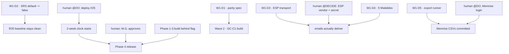

# Roadmap — GetCourse-parity Wave 1 + the R20 second front (2026H2)

_Created: 17-07-2026 · Last updated: 17-07-2026_

Sequencing doc of the plan set indexed by
[PLAN_SYSTEMA_GETCOURSE_PARITY_WAVE1_2026H2.md](https://github.com/gasyoun/Systema-Sanscriticum/blob/main/docs/PLAN_SYSTEMA_GETCOURSE_PARITY_WAVE1_2026H2.md).
Rulings R-1…R-6 live in that doc §1 and are not restated here. Authored by Opus 4.8
(`claude-opus-4-8[1m]`).

**Scope note.** This roadmap sequences *the wave*. It does **not** supersede
[ROADMAP_GETCOURSE_PARITY_2026.md](https://github.com/gasyoun/Systema-Sanscriticum/blob/main/docs/ROADMAP_GETCOURSE_PARITY_2026.md)
(the GC-* ticket analysis of record) or
[STUDENT_CABINET_HYBRID_PRODUCTION_SPEC_2026.md](https://github.com/gasyoun/Systema-Sanscriticum/blob/main/docs/STUDENT_CABINET_HYBRID_PRODUCTION_SPEC_2026.md)
(R29). Both stay canonical for their own content.

---

## 1. The shape

Two fronts run concurrently, plus one time-critical interrupt.

> **Front A (lead) — GetCourse parity.** Opens with a spec pass (R-1), because the
> programme is not build-ready. Produces the R29-equivalent that makes wave 2 executable.
>
> **Front B (second) — R20 cabinet hybrid.** Authorship is unblocked *now* (R-2); release
> is gated on a prod clock that has not started. Runs behind Front A for attention, not
> for calendar.
>
> **Interrupt — Memrise export (R-4).** Pre-empts on irreversibility alone, not on value
> ranking. Small, and it does not compete with either front for the same skills.

Why fronts and not a queue: Front B's binding constraint is a **calendar** (≥2 weeks of
prod baseline), and no amount of agent work shortens it. Front A's binding constraint is
**specification**. Serialising them would idle the calendar behind the spec for no gain.
R-5's serialisation applies to the *August measurement window* (§4), not to authorship.

---

## 2. Front A — wave 1

| # | Deliverable | Depends on | Gate |
|---|---|---|---|
| **W1-D1** | GetCourse-parity production spec (R29-equivalent) | — | none to author |
| **W1-D2** | Restore `SRS_ENABLED` default to `false` | — | none |
| **W1-D3** | ESP transport + preflight + `.env.example` fix | — | vendor account (human) |
| **W1-D4** | Marathon 5-email Mailables | W1-D3's config shape | delivery on W1-D3's gate |
| **W1-D5** | Memrise export runner + validator | — | Memrise login (human) |

**W1-D2 runs first in practice** despite its position. It is the smallest, and it closes a
live R-6 violation whose blast radius is the R20 baseline that Front B depends on. A deploy
shipping today surfaces SRS to students; every day it stays true is a day the baseline could
be contaminated. It should not queue behind a design pass.

**W1-D1 is the wave's headline and its long pole.** Everything in Front A's wave 2 depends
on it. It is a design pass, not a build — see
[ARCHITECTURE](https://github.com/gasyoun/Systema-Sanscriticum/blob/main/docs/ARCHITECTURE_SYSTEMA_GETCOURSE_PARITY_WAVE1.md) §2.

### 2.1 Wave 2 — sketch only, deliberately not specified

Wave 2 cannot be planned in detail here: **W1-D1's output is its input.** Specifying it now
would be exactly the "pretending it is build-ready" R-1 forbids. What is known:

- The head of wave 2 is **GC-C1** (`Deal` + kanban), per the H438 §5.6 ordering ruling, *if*
  W1-D1 confirms it is the right head.
- **GC-B2 is already done** ([PR #444](https://github.com/gasyoun/Systema-Sanscriticum/pull/444)).
- **GC-B1 is `@DECIDE`-blocked** and stays out until a human rules.
- Quizzes (GC-D*) and marketing (GC-A*) are wave 3+.

---

## 3. Front B — the R20 cabinet hybrid

Per R-2: **build now, release later.**

| Phase | State | Blocker |
|---|---|---|
| Phase 0 — instrumentation | **shipped** ([PR #534](https://github.com/gasyoun/Systema-Sanscriticum/pull/534), [v1.14.0](https://github.com/gasyoun/Systema-Sanscriticum/releases/tag/v1.14.0)) | — |
| **№25 prod deploy** | **merged, NOT deployed** | **human `@DO`** — starts the ≥2-week clock |
| Phase 1 — chassis | authorable now (R-2) | none |
| Phase 2 — «Записи» shelves + rail + lapse detector | authorable now (R-2) | none |
| Phase 3 — «Прогресс» path + вехи | authorable now (R-2) | none |
| Phase 4 — flag-flip release | **blocked** | ≥2 weeks of baseline **+** M.G. approval |

The clock **has not started**. It starts the day a human runs `sudo bash deploy.sh` for
DEPLOY_QUEUE №25 — no migration, no flag, no `.env` step; the only thing standing in the way
is prod access, which agents do not have. Earliest possible release is therefore *deploy date
+ 2 weeks + approval*, and it slips one-for-one with the deploy.

Phases 1–3 build behind the flag per R29 §5–6. Non-telemetry organs only (R-2); **no SRS
station** (R-6); **no arm-aware segmentation** (R-5).

---

## 4. What freezes

| Frozen | Ruling | Until |
|---|---|---|
| **SRS surfaced to students** — `SRS_ENABLED` on, `/dvaram/srs` reachable, menu item, any SRS station in R29 | R-6 | the hybrid ships. W1-D2 restores the default; nothing re-flips it without a human. |
| **RQ4 recruitment** — `RQ4_STUDY=true`, live enrolment | R-5 | autumn, after the R20 baseline owns the August window. Harness is built and idle. |
| **Arm-aware segmentation work** of any kind | R-5 | not scheduled |
| **The 28-08 marathon cohort as an RQ4 recruitment source** | R-5 | permanently — ruled out, not deferred |
| **Cabinet hybrid *release*** (not authorship) | R-2 | №25 deploy + ≥2 weeks + M.G. approval |
| **H1068 header/footer/about copy** | D1 fork open | a human rules D1 |
| **GC-B1** per-schedule Zoom auto-create | standing `@DECIDE` | a human rules |
| **Money core** — payments, tariffs, revenue recognition | scope | no wave-1 deliverable touches it |
| **Memrise trainer scope** — P1–P6 of the Memrise roadmap | R-4 ("trainer scope stays out") | export lands + a later ruling |

Two entries deserve their reasoning stated, because they look like ordinary deferrals and
are not:

- **RQ4 (R-5).** The harness is *merged*. The freeze is not "we haven't built it" — it is a
  deliberate refusal to spend the August window on it, because two live measurements in one
  window contaminate each other. The cost is a season of idle capability, accepted knowingly.
- **SRS (R-6).** Same measurement logic, opposite failure mode: the freeze is currently
  **not holding in code**. That is what makes W1-D2 wave-1 work instead of a policy line.

---

## 5. Dependency at a glance

Every terminal outcome in that graph except **wave 2** and **a clean baseline** has a human
node upstream of it. That is the plan's real shape, and §3.1 of the
[PLAN](https://github.com/gasyoun/Systema-Sanscriticum/blob/main/docs/PLAN_SYSTEMA_GETCOURSE_PARITY_WAVE1_2026H2.md)
says so rather than hiding it behind step counts.

## 6. Sequencing rule for the executing agent

Take deliverables in the §2 order, except W1-D2 first (§2 explains why). On hitting a human
gate: write the `@DO`/`@DECIDE` row, then move to the next deliverable. Never idle, never
guess past a gate. Full autonomy contract:
[PLAN §2](https://github.com/gasyoun/Systema-Sanscriticum/blob/main/docs/PLAN_SYSTEMA_GETCOURSE_PARITY_WAVE1_2026H2.md).

_Dr. Mārcis Gasūns_
