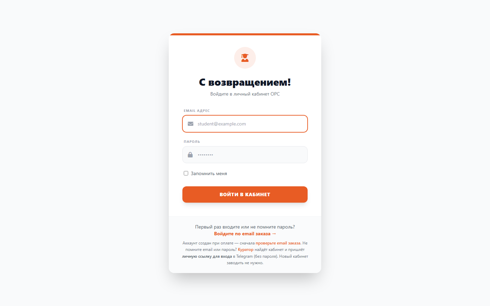
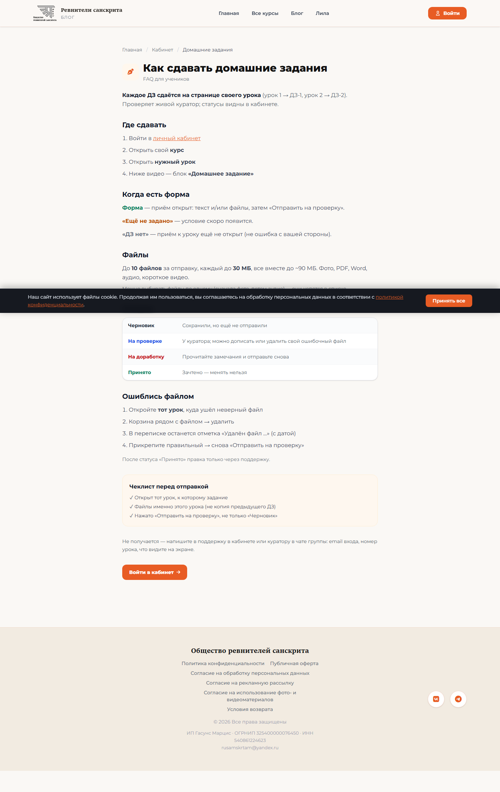
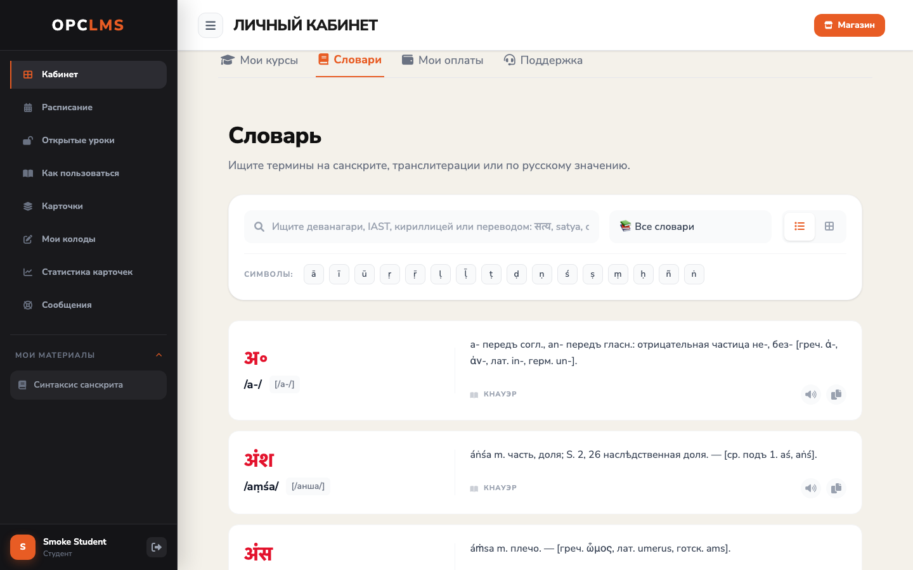
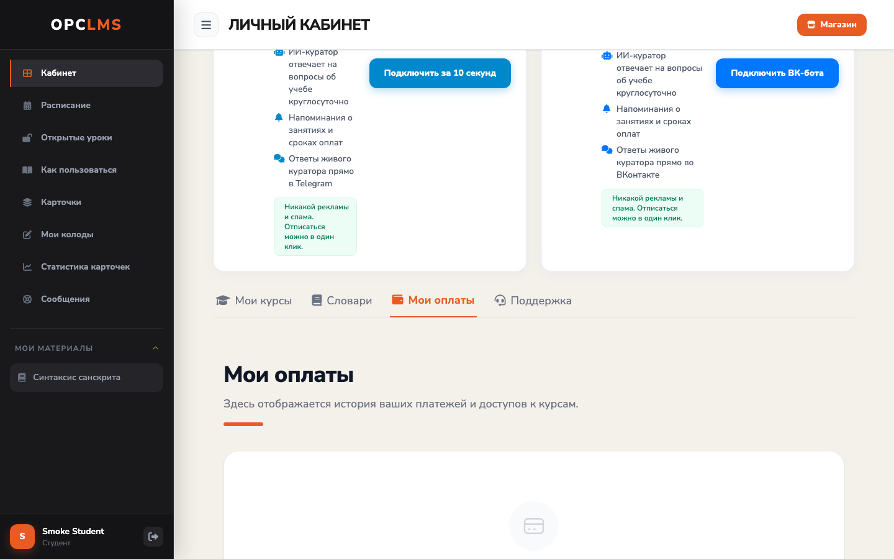
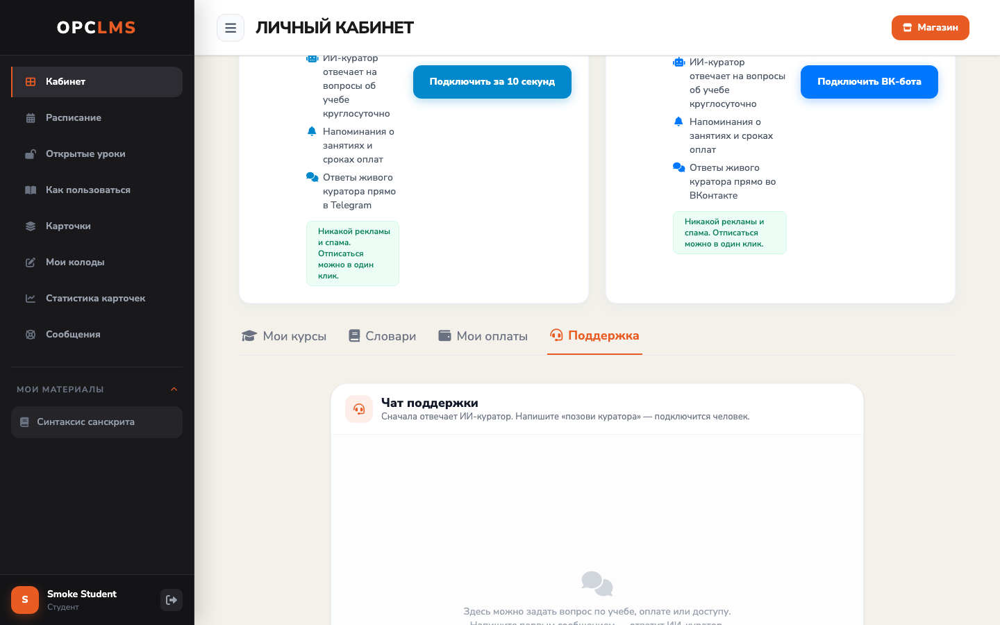
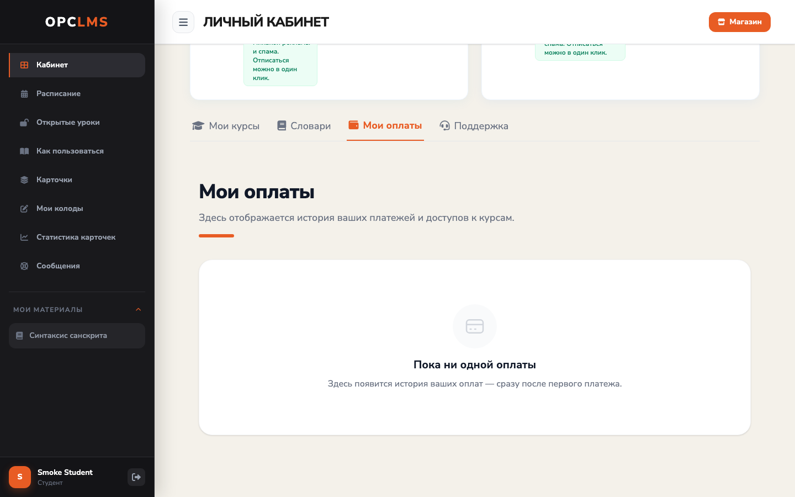
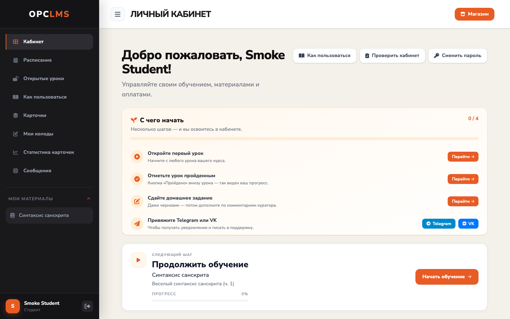
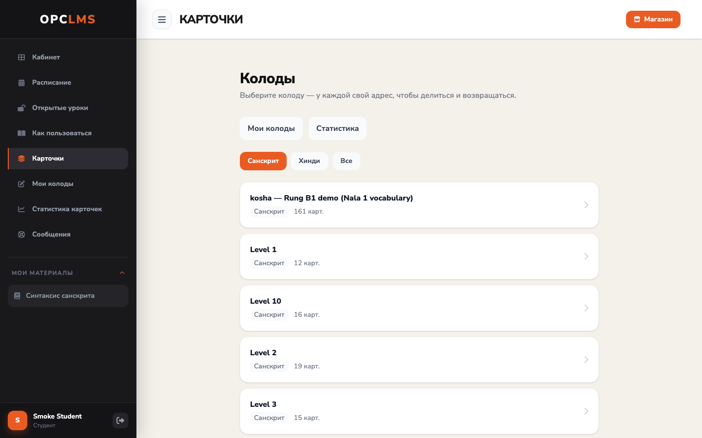
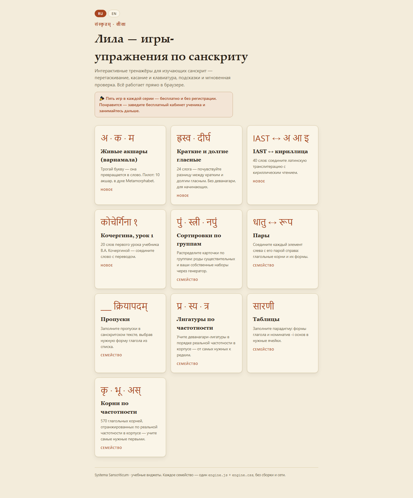

# Как пользоваться кабинетом

_Created: 21-08-2026 · Last updated: 27-08-2026_

Все книги школы: `/admin/documentation`

Это руководство для ученика. Если нужно **сделать одно действие сейчас** — часть I.
Если открыли вкладку и не понимаете, что это — часть II.

Печатная копия совпадает с этой страницей. Актуальная версия всегда здесь:
[https://samskrte.ru/help/kabinet](https://samskrte.ru/help/kabinet).

## Содержание

- **Часть I. Сценарии** — семь задач, которые встречаются чаще всего
  - [Войти в кабинет](#войти-в-кабинет)
  - [Открыть следующий урок](#открыть-следующий-урок)
  - [Сдать домашнее задание](#сдать-домашнее-задание)
  - [Найти слово в словаре](#найти-слово-в-словаре)
  - [Оплатить долг или взнос по рассрочке](#оплатить-долг-или-взнос-по-рассрочке)
  - [Почему урок закрыт](#почему-урок-закрыт)
  - [Позвать куратора](#позвать-куратора)
- **Часть II. Справочник по вкладкам кабинета**
- **Часть III. Что нельзя сломать**
- **Часть IV. Частые вопросы**

# Часть I. Сценарии

## Войти в кабинет

**Что получится.** Вы окажетесь на главной кабинета — «Добро пожаловать» и вкладка **«Мои курсы»**.

### Шаги

1. Откройте [samskrte.ru/login](https://samskrte.ru/login).
2. Если пароль уже есть — введите **Email адрес** и **Пароль**, нажмите **«Войти в кабинет»**.
3. Первый вход или забытый пароль: ссылка **«Войдите по email заказа →»**. Введите почту, с которой покупали курс, и нажмите **«Проверить email и войти»**. Письмо со ссылкой часто лежит в папке «Спам».
4. Можно войти кнопками **Google**, **ВКонтакте** или **Яндекс**, если они видны на странице.
5. Галочку **«Запомнить меня»** ставьте только на своём компьютере или телефоне.
6. Не помните ни почту, ни пароль — не заводите новый кабинет. Напишите [куратору](https://t.me/rusamskrtam): пришлют **личную ссылку для входа** (действует сутки, пароль не нужен).

На телефоне — тот же кадр `screenshots/student-guide/voiti-390.png`.

### Если пошло не так

- **Письмо не пришло.** Проверьте «Спам» и написание адреса. Регистр букв не важен: `Anna@Mail.ru` и `anna@mail.ru` — один кабинет.
- **«Не нашли».** Заказ мог быть на другую почту. Попробуйте её или напишите куратору.

## Открыть следующий урок

**Что получится.** Откроется страница урока: видео, материалы, домашнее задание.

### Шаги

1. После входа вы на [samskrte.ru/dvaram](https://samskrte.ru/dvaram).
2. Если сверху есть карточка **«Следующий шаг»** — нажмите оранжевую кнопку справа (подпись вроде «Открыть урок»).
3. Иначе вкладка **«Мои курсы»** → карточка курса → урок.
4. Слева в меню курс лежит в блоке **«Мои материалы»**.
5. На странице урока: видео, **Транскрипт**, файлы, кнопка **«Подключиться к Zoom»**, если занятие сегодня.

На телефоне — тот же кадр `screenshots/student-guide/otkryt-urok-390.png`.

### Если пошло не так

- Курса нет в списке — он не оплачен или доступ ещё собирается. См. [Почему урок закрыт](#почему-урок-закрыт).
- Видео пустое после эфира: «Запись появится здесь после занятия» — подождите; отдельно страницы «записи» нет.

## Сдать домашнее задание

**Что получится.** Работа уйдёт куратору. Статус на странице урока сменится.

Подробная инструкция (лимиты файлов, как исправить неверный файл) — публично, без входа: [https://samskrte.ru/faq/dz](https://samskrte.ru/faq/dz). Ниже — короткий путь.

### Шаги

1. Откройте урок, у которого открыт приём работы.
2. Напишите ответ в текстовом поле и при необходимости приложите файлы (до 10 файлов, до 30 МБ каждый).
3. **«Сохранить черновик»** — остаётся только у вас.
4. **«Отправить на проверку»** — уходит куратору. Черновик куратор не видит.
5. Комментарий куратора появится под заданием. Статусы: черновик, на проверке, принято, на доработку.

На телефоне — тот же кадр `screenshots/student-guide/sdat-dz-390.png`.

### Если пошло не так

- **Не тот файл.** Откройте [инструкцию по ДЗ](https://samskrte.ru/faq/dz) — там, как заменить.
- **Долго «на проверке».** Напомните через вкладку **«Поддержка»** или напишите **«позови куратора»**.

## Найти слово в словаре

**Что получится.** На той же странице кабинета появятся словарные статьи.

### Шаги

1. На главной кабинета откройте вкладку **«Словари»**.
2. Введите слово: деванагари, латиница, кириллица или перевод — поиск смотрит сразу все поля.
3. Откройте нужную статью в списке.

На телефоне — тот же кадр `screenshots/student-guide/slovar-390.png`.

### Если пошло не так

- Пустой список — попробуйте короче запрос или другую письменность того же слова.
- Словарь хинди по программе — пункт **«Мой хинди»** в меню, если он у вас есть.

## Оплатить долг или взнос по рассрочке

**Что получится.** После оплаты блоки курса откроются сами. Вкладка **«Мои долги»** пропадёт, когда долга не останется.

### Шаги

1. На главной откройте вкладку **«Мои долги»**. Её нет — долга нет.
2. Строка **«не продлил»**: кнопка **«Оплатить»** — штатная оплата блока или сразу всего диапазона.
3. Рассрочка: **«Внести N ₽»** (ближайший взнос) или **«Погасить всё (M ₽)»**.
4. На странице оплаты рассрочки можно списать прану ползунком и один раз перенести дату ближайшего платежа вперёд.
5. Сообщение куратору в Telegram **само дату отсрочки не ставит**. Просите «зафиксируйте в кабинете» и проверяйте эту вкладку.

На телефоне — тот же кадр `screenshots/student-guide/oplati-dolg-390.png`.

### Если пошло не так

- Оплатили, а вкладка ещё на месте — обновите страницу через пару минут, затем [Почему урок закрыт](#почему-урок-закрыт).
- Вкладка **«Мои оплаты»** — история платежей: дата, сумма, за что, статус.

## Почему урок закрыт

**Что получится.** Либо урок откроется безопасной кнопкой, либо станет ясно, что докупить или кому написать.

### Шаги

1. На карточке закрытого урока откройте блок **«Почему закрыто?»**.
2. Если есть **«Открыть оплаченные блоки»** — нажмите: доступ пересоберётся по уже оплаченному, деньги не трогает.
3. **«Подключить бота»** — если не хватает привязки Telegram или VK.
4. **«Сбросить пароль»** — если дело во входе.
5. Платежа нет — вкладка **«Мои долги»** или [Позвать куратора](#позвать-куратора).

На телефоне — тот же кадр `screenshots/student-guide/pochemu-zakryt-390.png`.

### Если пошло не так

- Кнопки нет — self-service на этом курсе выключен. Пишите в **«Поддержку»**.
- Замок на целом блоке при оплаченном тарифе — подождите минуты после оплаты, затем кнопку, затем куратора.

## Позвать куратора

**Что получится.** Диалог перейдёт живому человеку. Ответ придёт в том же чате (и в Telegram/VK, если бот подключен).

### Шаги

1. На главной откройте вкладку **«Поддержка»** — или пункт **«Сообщения»** / **«Помощь»** в меню слева.
2. Задайте вопрос: сначала ответит учебный помощник по FAQ школы.
3. Нужен человек — напишите **«позови куратора»** (подойдут похожие слова).
4. Чтобы не пропустить ответ: **«Подключить за 10 секунд»** (Telegram) или **«Подключить ВК-бота»** на главной.

На телефоне — тот же кадр `screenshots/student-guide/pozvat-kuratora-390.png`.

### Если пошло не так

- Помощник просит написать **«позови куратора»** — так и напишите.
- Срочно и чат молчит: [t.me/rusamskrtam](https://t.me/rusamskrtam).

# Часть II. Справочник по вкладкам кабинета

## Мои курсы

Главная вкладка. Карточки оплаченных курсов, прогресс, ссылка на следующий урок. Неоплаченный блок — «под замком». Кнопка **«Проверить кабинет»** справа сверху — короткий тест «понимаю ли я кабинет», не экзамен по санскриту.

На телефоне — тот же кадр `screenshots/student-guide/tab-kursy-390.png`.

## Словари

Поиск по словарям школы на главной. См. [Найти слово в словаре](#найти-слово-в-словаре).

## Мои оплаты

История: дата, сумма, курс или блок, статус. Отсюда видно, покрыт ли блок платежом.

На телефоне — тот же кадр `screenshots/student-guide/tab-oplaty-390.png`.

## Мои долги

Только если долг есть. См. [Оплатить долг или взнос по рассрочке](#оплатить-долг-или-взнос-по-рассрочке).

На телефоне — тот же кадр `screenshots/student-guide/tab-dolgi-390.png`.

## Прана

Вкладка есть, только если школа включила прану. Баланс, история, магазин (**«Обменять»**), стрик входов, бейджи, рейтинг **Неделя / Месяц / Всё время**, перевод другому ученику (**email + сумма → «Отправить»**).

Куда делась прана без покупки — история на этой вкладке: сгорание за долгое отсутствие или перевод. Отдельного счётчика сгорания нет. Подробнее: [https://samskrte.ru/help/prana-balance](https://samskrte.ru/help/prana-balance).

На телефоне — тот же кадр `screenshots/student-guide/tab-prana-390.png`.

## Колода (карточки)

Пункт **«Карточки»** в меню — интервальные повторения. Рядом **«Мои колоды»** и **«Статистика карточек»**, если колоды включены. Канонический адрес: `/dvaram/koloda`.

На телефоне — тот же кадр `screenshots/student-guide/koloda-390.png`.

## Лила

Бесплатные короткие упражнения: [https://samskrte.ru/lila/](https://samskrte.ru/lila/). Это не вкладка кабинета. Гость проходит одну законченную игру бесплатно; в кабинете — все тренажёры. Жест: карточки → **«Проверить»** → **«Заново»**.

На телефоне — тот же кадр `screenshots/student-guide/lila-390.png`.

## Профиль

Отдельной страницы «Профиль» нет.

- **Сменить пароль** — кнопка **«Сменить пароль»** на главной: **Текущий пароль**, **Новый пароль**, **Повторите новый пароль**, **«Сохранить»**.
- Имя и email сам ученик не меняет — это делает куратор.
- Аватар подтягивается из Telegram или VK после привязки; иначе — инициал.

На телефоне — тот же кадр `screenshots/student-guide/profil-390.png`.

## Меню слева

На обычном кабинете: **Кабинет**, **Расписание**, **Открытые уроки**, **Как пользоваться**, **Сообщения**. Если школа включила новый вид кабинета: **Сегодня**, **Календарь**, **Записи**, **Прогресс**, **Оплата и доступ**, **Помощь**. Внизу меню — имя и кнопка выхода.

# Часть III. Что нельзя сломать

Чужие данные ученик не ломает. Ломается только свой вход.

- **Чужой или библиотечный компьютер.** Не ставьте **«Запомнить меня»**. После работы нажмите выход внизу меню (иконка двери).
- **«Запомнить меня»** держит вход после закрытия браузера. Смена пароля в кабинете сбрасывает это на **всех** устройствах.
- Не создавайте второй кабинет, если не помните почту: куратор найдёт старый и пришлёт личную ссылку.
- Не отвязывайте Telegram или VK без нужды: пропадут учебные уведомления. Подпись кнопки — **«Отвязать»**, с подтверждением.

# Часть IV. Частые вопросы

**Оплатил, но курс не открылся.**
Доступ собирается сам, обычно за минуты. На закрытом уроке — **«Почему закрыто?»**. Не помогло — **«Поддержка»**.

**Не вижу урок / он «под замком».**
Часто урок в блоке, который ещё не куплен. Проверьте **«Мои оплаты»** и **«Мои долги»**.

**Куратор долго не проверяет ДЗ.**
Проверка руками. Напомните через **«Поддержку»** или **«позови куратора»**.

**Как сменить пароль?**
Кнопка **«Сменить пароль»** на главной кабинета.

**Не помню email / пароль.**
Не регистрируйтесь заново. Сначала **«Войдите по email заказа»**. Если почта неизвестна — куратору в Telegram (ФИО, курс, когда платили): пришлют личную ссылку.

**Не вижу вкладку «Прана» / «Мои долги».**
«Прана» — если школа её включила. «Мои долги» — только пока долг есть.

**Где полная инструкция по домашнему заданию?**
[https://samskrte.ru/faq/dz](https://samskrte.ru/faq/dz).

**Нужно ли регистрироваться отдельно после покупки курса?**
Нет. Кабинет уже создан на email заказа: входите через **«Войдите по email заказа»**. Кнопка «Регистрация» на главной заведёт второй кабинет без оплат.

**Статус домашки «на доработку» — это зачёт?**
Нет. Работу вернули: исправьте файл или текст на странице урока и сдайте снова. Четыре статуса: черновик / на проверке / на доработку / принято.

**Как искать в словаре кабинета?**
Одним полем: деванагари, латиницей (IAST), кириллицей или переводом. Не только деванагари.

**Галочка «Запомнить меня» на чужом компьютере (библиотека, кафе)?**
Не ставить: вход останется на этом компьютере. Смена пароля в кабинете сбрасывает все такие входы.

_Dr. Mārcis Gasūns_
