# Руководство преподавателя: работа в учебной панели

_Created: 12-08-2026 · Last updated: 31-08-2026_

Все книги школы: `/admin/documentation`

Это руководство отвечает на два разных вопроса, и потому разделено на части.
Если вам нужно **что-то сделать прямо сейчас** — идите в часть I, там сценарии
целиком, от начала до конца. Если вы **уже открыли раздел и не понимаете, что это** —
идите в часть II, там по одному описанию на каждый пункт меню.

## Содержание

- **Часть I. Сценарии** — семь задач, которые встречаются чаще всего
  - [Провести занятие: до, во время, после](#провести-занятие-до-во-время-после)
  - [Проверить домашнюю работу](#проверить-домашнюю-работу)
  - [Создать урок](#создать-урок)
  - [Изменить расписание и календарь](#изменить-расписание-и-календарь)
  - [Выдать сертификат](#выдать-сертификат)
  - [Добавить карточки в колоду](#добавить-карточки-в-колоду)
  - [Посмотреть свою нагрузку и расчёты](#посмотреть-свою-нагрузку-и-расчёты)
- **Часть II. Справочник по разделам панели** — что это, где лежит, что можно менять
- **Часть III. Безопасность и границы** — что нельзя сломать и куда идти за откатом
- **Часть IV. Частые вопросы и чек-листы**

## Как читать пометки у шагов

У каждого шага сценария стоит одна из трёх пометок. Она отвечает ровно на один
вопрос: что будет, если вы передумаете.

| Пометка | Что означает |
|---|---|
| **[Безопасно]** | Результат виден только внутри панели и отменяется тем же экраном. |
| **[Видно студенту]** | Отражается в кабинете студента сразу. Рядом написано, что именно он увидит. |
| **[Необратимо]** | Своими силами не откатывается. Рядом написано, к кому идти. |

> **Только куратор.** Абзацы с такой пометкой относятся к кураторской части работы.
> Если вы ведёте только занятия, их можно пропустить.

## Вход в панель

1. Откройте [samskrte.ru/admin](https://samskrte.ru/admin).
2. Войдите почтой и паролем, которые выдал администратор школы.
3. После входа вы попадаете в раздел **«Курсы»** — отдельной стартовой страницы
   у преподавателя нет, это нормально.

Если разделы пустые и ничего не сохраняется, ваш аккаунт ещё не связан с карточкой
преподавателя. Напишите администратору: без этой связи панель намеренно ничего
не показывает.

# Часть I. Сценарии

## Провести занятие: до, во время, после

**Зачем.** Занятие живёт в трёх местах — в расписании, в уроке и в посещаемости;
этот сценарий связывает их в один проход.

### Шаги

1. **[Безопасно]** За день до занятия откройте **«Расписание»** и убедитесь, что
   событие есть, время верное и ссылка на встречу вставлена.
2. **[Видно студенту]** Если ссылки нет — откройте событие и вставьте её. Студент
   увидит ссылку в своём кабинете и в календаре сразу после сохранения.
3. **[Безопасно]** Проверьте, что у события выбран ваш курс, а при двух потоках —
   нужная группа. Пустое поле группы означает «событие для всех групп курса».
4. **[Безопасно]** В день занятия откройте **«Расписание»**: у ближайшего события
   подсвечен статус — идёт сейчас, скоро, прошло. Кнопка с камерой открывает
   ссылку встречи прямо из списка.
5. **[Видно студенту]** После занятия положите запись и материалы в урок этого
   занятия (см. [Создать урок](#создать-урок)). Студенты, оплатившие блок,
   увидят их сразу.
6. **[Безопасно]** Загляните в **«Посещаемость»**, если этот раздел есть в вашем
   меню: там видно, кто дошёл до встречи.

### Что увидит студент

Ссылку на встречу — в кабинете и в календаре. Запись и материалы — на странице
урока, если он оплатил соответствующий блок курса.

### Если пошло не так

- **Студент пишет, что не видит ссылку.** Проверьте, что у события выбран курс и
  что студент состоит в указанной группе.
- **Событие создано на прошлую дату.** Отредактируйте время — событие вернётся в
  список будущих. Фильтр «Период» по умолчанию показывает только будущие.

## Проверить домашнюю работу

**Зачем.** Самое частое действие. Работа ждёт вас, пока вы не вынесете решение,
и студент об этом знает.

### Шаги

1. **[Безопасно]** Откройте **«Домашние работы»**. Рядом с пунктом меню горит
   счётчик — это число работ на проверке. Список по умолчанию отфильтрован
   именно по этому статусу.
2. **[Безопасно]** Нажмите **«Проверить»** напротив работы. Откроется карточка:
   студент, урок и вся переписка с файлами.
3. **[Безопасно]** Прочитайте текст и откройте файлы студента.
4. **[Видно студенту]** Нажмите **«Принять»** — работа зачтена. Комментарий и файлы
   с правками необязательны, но студент их получит.
5. **[Видно студенту]** Или нажмите **«Вернуть на доработку»** — здесь комментарий
   **обязателен**: напишите, что именно исправить.
6. **[Безопасно]** Убедитесь, что счётчик у «Домашних работ» уменьшился.

### Что увидит студент

Письмо со ссылкой на урок и вашим комментарием — сразу после вашего решения.
Приложенные файлы с правками он тоже получит. Статус работы в его кабинете
сменится на «Принято» или «На доработку».

### Если пошло не так

- **Вернули не ту работу.** Решение переигрывается: откройте работу снова и
  вынесите другое. Студенту уйдёт ещё одно письмо, поэтому припишите в
  комментарии, что предыдущее было ошибкой.
- **Работы нет в списке.** Работы создают только студенты из своего кабинета;
  завести работу за студента нельзя. Черновики вам не показываются — только
  отправленное.

> **Только куратор.** Если вам выдали проверку чужих групп, в списке появятся
> работы студентов этих групп по их курсам. Своя собственная работа в очередь
> проверки не попадает никогда.

## Создать урок

**Зачем.** Урок — это контейнер для видео, материалов и домашнего задания.
Пока урока нет, студенту нечего открыть.

### Шаги

1. **[Безопасно]** **«Уроки»** → кнопка **«Создать»** справа вверху.
2. **[Безопасно]** В поле **«Привязать к курсу»** выберите свой курс. Рядом с
   названием стоит номер — он различает одноимённые курсы разных потоков.
3. **[Безопасно]** Заполните название, выберите **блок** курса и укажите дату и
   время урока. Блок решает, кто увидит урок: студент видит его, только если
   оплатил этот блок или весь курс.
4. **[Безопасно]** Добавьте ссылки на видео и загрузите материалы — до 100 МБ на
   файл. Файлы можно перетаскивать, меняя порядок, и докладывать новые.
5. **[Безопасно]** Если нужно домашнее задание — разверните секцию
   **«Домашнее задание»** и включите переключатель. Напишите условие: это текст,
   который увидит студент.
6. **[Видно студенту]** Сохраните урок. Студенты с оплаченным блоком увидят его
   в тот же момент.

### Что увидит студент

Урок в списке своего курса; внутри — видео, материалы и, если вы его включили,
условие домашнего задания с формой отправки.

### Если пошло не так

- **Студент говорит, что не видит урок.** Проверьте две вещи: урок привязан к
  правильному блоку, и студент оплатил этот блок. Если урок заведён на конкретную
  группу — что студент состоит именно в ней.
- **Не перетаскиваются уроки.** Сначала выберите конкретный курс в фильтре над
  таблицей: порядок считается внутри одного курса.
- **Урок не должен быть виден пока рано.** Заведите его в блоке, который ещё не
  открыт, либо создайте перед самым занятием — отдельного «черновика» у урока нет.

## Изменить расписание и календарь

**Зачем.** Перенос занятия — то место, где легче всего задеть студента: он уже
записал время себе.

### Шаги

1. **[Безопасно]** Откройте **«Расписание»** или **«Календарь»** — это два вида
   на один и тот же список событий.
2. **[Видно студенту]** Измените время события: в расписании — через
   редактирование, в календаре — перетаскиванием, оно спросит подтверждение.
   Новое время студент увидит немедленно.
3. **[Видно студенту]** Если занятие переносится, а не отменяется, поправьте
   ссылку на встречу, если она изменилась.
4. **[Безопасно]** Для регулярных занятий пользуйтесь кнопками
   **«Дублировать на завтра»** и **«на +неделю»** — копия события со сдвинутой
   датой.
5. **[Видно студенту]** Об изменении сообщите студентам сами, в чате курса.
   Панель меняет время молча — письма о переносе она не рассылает.
6. **[Безопасно]** Постоянную смену дня/времени курса (переход на другой
   слот с сентября и т.п.) делает куратор или администратор через
   **«Сгенерировать поток»** в разделе «Расписания» админки — с флагом
   «Не трогать прошедшие занятия». Преподавателем в кабинете меняются
   отдельные события, не весь будущий поток. Подробности:
   [Curator guide — раздел «Расписание: перенос занятия и смена дня/времени»](https://github.com/gasyoun/Systema-Sanscriticum/blob/main/docs/CURATOR_ADMIN_GUIDE_RU.md#расписание-перенос-занятия-и-смена-днявремени).

### Что увидит студент

Новое время в своём кабинете и в календаре. Отдельного уведомления о переносе
он не получит — поэтому шаг 5 обязателен.

### Если пошло не так

- **Перетащили не то событие.** Верните время обратно тем же способом. Ничего
  необратимого не произошло.
- **Удалили событие вместо переноса.** Создайте заново; данных о посещаемости у
  будущего события ещё нет, поэтому потеря ограничена самим событием.

## Выдать сертификат

**Зачем.** Завершающее действие курса. Оно необратимо в глазах студента: файл уже
у него на руках.

### Шаги

1. **[Безопасно]** Откройте **«Сертификаты»** → **«Создать»**.
2. **[Безопасно]** Выберите студента и курс — доступны только ваши курсы.
3. **[Безопасно]** Проверьте фамилию, имя и название курса. Они подставляются
   автоматически, но их можно поправить; вертикальная черта в названии означает
   перенос строки.
4. **[Безопасно]** Выберите шаблон. У шаблона «Санка» появятся поля для баллов за
   экзамен — для остальных шаблонов баллы не нужны.
5. **[Необратимо]** Сохраните. Файл сформируется сразу, и студент получает
   сертификат со своим именем. Опечатка в имени после этого исправляется только
   отзывом и повторной выдачей — за отзывом идите к администратору школы.
6. **[Безопасно]** Кнопка **«JPG»** в списке скачивает картинку сертификата, если
   нужно отправить её самому.

### Что увидит студент

Готовый сертификат со своим именем и названием курса.

### Если пошло не так

- **Опечатка в имени.** Не выдавайте второй сертификат «поверх» первого — сначала
  попросите администратора отозвать ошибочный, потом выдайте новый.
- **Не тот шаблон.** То же самое: отзыв, затем повторная выдача.
- **Студента нет в списке.** Он не числится на вашем курсе. Это вопрос к
  администратору: состав групп формируется по оплатам.

## Добавить карточки в колоду

**Зачем.** Карточки для повторения студенты учат у нас, а не на стороннем сервисе.
Источник правды — эта панель.

### Шаги

1. **[Безопасно]** Откройте **«SRS — колоды»** и выберите нужную колоду. Новую
   колоду заводят кнопкой **«Создать»**: название, адрес и язык.
2. **[Безопасно]** Внутри колоды найдите блок карточек и нажмите
   **«Добавить карточку»**.
3. **[Безопасно]** Заполните написание — деванагари, латиницей или кириллицей, по
   необходимости — и **перевод**: он обязателен.
4. **[Безопасно]** Выберите направление показа: от написания к переводу или наоборот.
5. **[Видно студенту]** Сохраните. Карточка появляется в учебном разделе у
   студентов, у которых открыта эта колода.
6. **[Безопасно]** Для большой пачки слов пользуйтесь разделом
   **«SRS — карточки»**: там есть импорт и выгрузка таблицей. Выгрузка годится и
   как резервная копия.

### Что увидит студент

Новые карточки в своей колоде при следующем заходе; очки за повторения идут в
таблицы лидеров.

### Если пошло не так

- **Карточка не появилась у студента.** Проверьте видимость колоды: у закрытой
  колоды свой список тех, кому она открыта.
- **Слово нужно и в общем словаре.** Раздел **«Словарный запас»** — отдельный
  каталог слов; карточку можно связать со словом оттуда.

Подробная версия этого сценария, с переносом со стороннего сервиса, —
[MANUAL_TEACHER_SRS_KOLODA_RU.md](https://github.com/gasyoun/Systema-Sanscriticum/blob/main/docs/MANUAL_TEACHER_SRS_KOLODA_RU.md).

## Посмотреть свою нагрузку и расчёты

**Зачем.** Чтобы свериться с цифрами, а не чтобы их менять. Весь этот сценарий —
только чтение.

### Шаги

1. **[Безопасно]** Откройте **«Нагрузка преподавателей»**, если раздел вам виден:
   там показано, сколько занятий и групп за вами числится.
2. **[Безопасно]** Сверьте состав своих групп в разделе **«Мои ученики»**.
3. **[Безопасно]** Откройте **«Моя зарплата»**: начислено за месяц, возвраты,
   выплачено, остаток к выплате. Это ваш расчёт, чужих преподавателей там нет.
4. **[Безопасно]** Если цифра расходится с вашей — напишите администратору,
   назвав курс, период и то, что ожидали увидеть.

### Что увидит студент

Ничего. Это служебные экраны.

### Если пошло не так

Расчёт на экране «Моя зарплата» можно читать. Записать выплату, закрыть месяц
или поменять ставку преподаватель не может — это бухгалтерия. Если сумма не
сходится, напишите администратору школы.

# Часть II. Справочник по разделам панели

Ниже — по одному описанию на каждый пункт, который вы видите в меню. Список
сверен с панелью машинально, а не по памяти: если раздел здесь есть, вы его
видите, и наоборот. Некоторые пункты к вашей ежедневной работе не относятся —
они всё равно описаны, потому что вы их видите и рано или поздно спросите, что
это такое.

Групп у вас четыре: **«Обучение»**, **«Пользователи»**, **«Допматериалы»** и
**«Продажи»** (в ней один пункт — **«Моя зарплата»**). Маркетинг, финансы школы
и чужие зарплаты в вашем меню нет. Если вы слышали, что «в панели всего слишком
много», это про число пунктов внутри «Обучения», а не про чужие разделы.

> **О снимках экрана.** Каждый раздел ниже показан кадром из самой панели. Кадры
> снимаются автоматически, по одному на каждый пункт меню, поэтому они не
> отстают от интерфейса. Данные на них учебные: имена студентов, курс и уроки
> придуманы. Денежных экранов среди кадров нет и не будет: зарплаты, выплаты и
> взаиморасчёты не снимаются никогда.

## Обучение

### Курсы

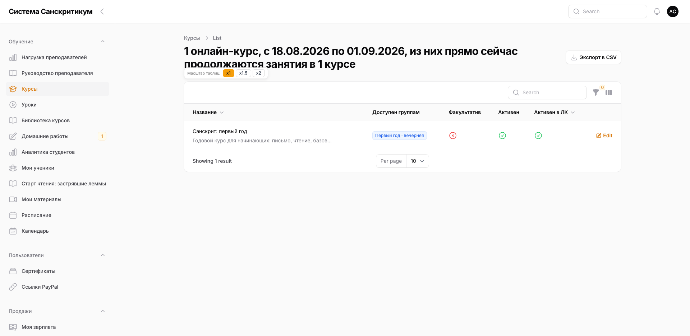

Курсы, закреплённые за вами. Открывается кнопкой **«Редактировать»**.

Менять можно: название, адрес страницы, описание, ссылку на чат курса, число
уроков и часов, видимость на сайте и доступность в кабинете, категорию и формат.
Адрес страницы меняйте осторожно — старые ссылки перестанут работать.

Блоки «Преподаватель и зарплата», «Тарифы и цены» и «Доступ для групп» вам не
показываются: цены, ставку и привязку курса ведёт администратор.

### Уроки

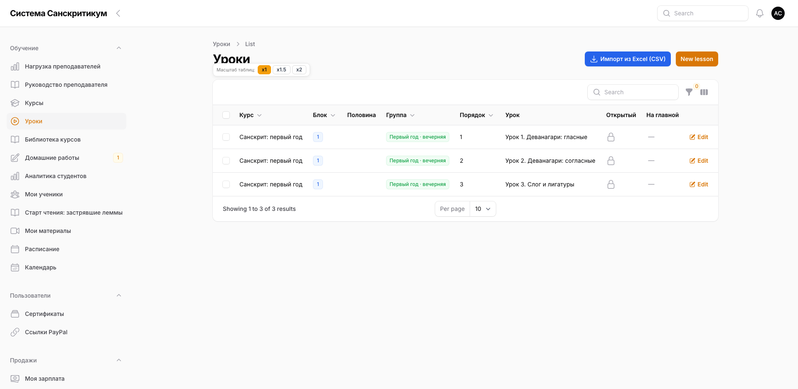

Главный рабочий раздел: видео, материалы, домашние задания. Сценарий —
[Создать урок](#создать-урок).

Отдельно стоит знать про два поля. **Открытый урок** доступен любому вошедшему
студенту без покупки. **Показывать на главной** выводит карточку урока на витрину
сайта и работает только вместе с «открытым».

### Домашние работы

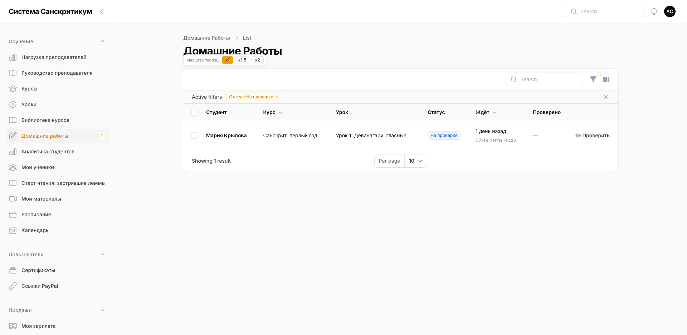

Очередь работ, присланных по вашим урокам, со счётчиком непроверенного.
Сценарий — [Проверить домашнюю работу](#проверить-домашнюю-работу).

Три статуса: «На проверке» (ждёт вас), «На доработку» (вернули с замечаниями),
«Принято» (зачтено).

### Мои ученики

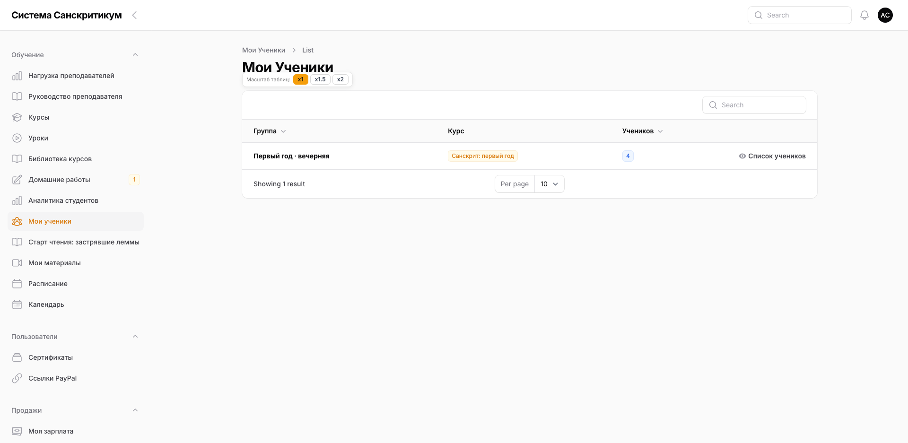

Состав учебных групп ваших курсов: имя, почта, время последней активности.
Раздел **только для просмотра**.

Добавить или убрать студента здесь нельзя, и это не ошибка: состав формируется
автоматически по оплатам. Ручные правки состава — у администратора.

### Расписание

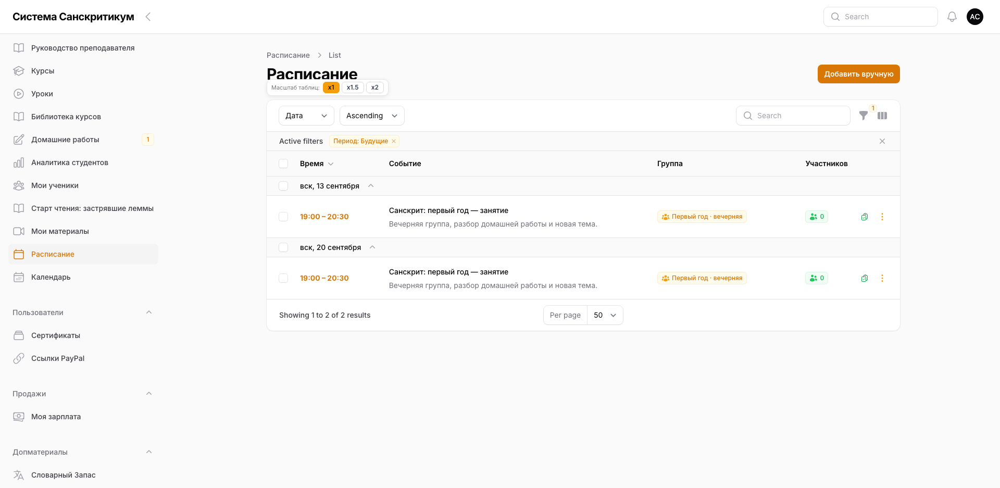

Занятия ваших курсов со ссылками на встречи. Сценарии —
[Провести занятие](#провести-занятие-до-во-время-после) и
[Изменить расписание](#изменить-расписание-и-календарь).

Полезное в списке: кнопка с камерой открывает встречу, кнопки дублирования
создают копию события со сдвинутой датой, фильтр «Период» по умолчанию прячет
прошедшее.

### Календарь

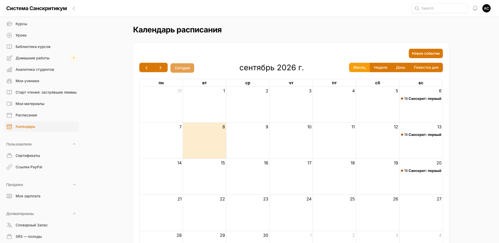

Те же события, что и в расписании, но в виде календаря: месяц, неделя, день,
список. Клик по дате создаёт событие, перетаскивание меняет время с
подтверждением. Неделя начинается с понедельника.

Это один и тот же набор данных — что создали в одном разделе, появится в другом.

### Библиотека курсов

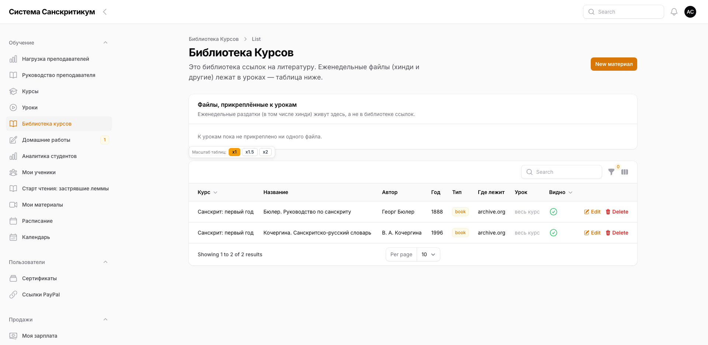

Реестр литературы, привязанной к курсу целиком, а не к отдельному уроку. Кладите
сюда то, что нужно на протяжении всего курса: программу, список источников,
таблицы.

### Аналитика студентов

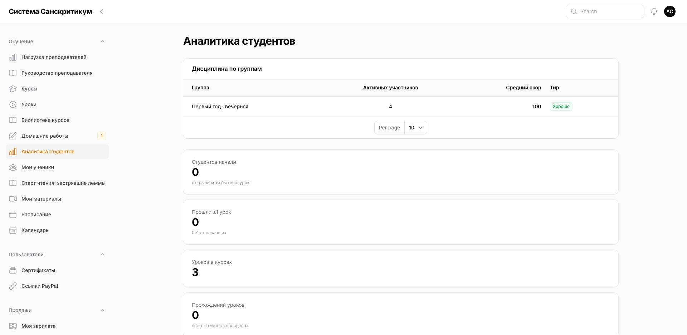

Сводка по вашим студентам: как они продвигаются по курсу. Раздел для просмотра —
изменить отсюда ничего нельзя, и это правильно: цифры считаются по их
собственным действиям.

### Нагрузка преподавателей

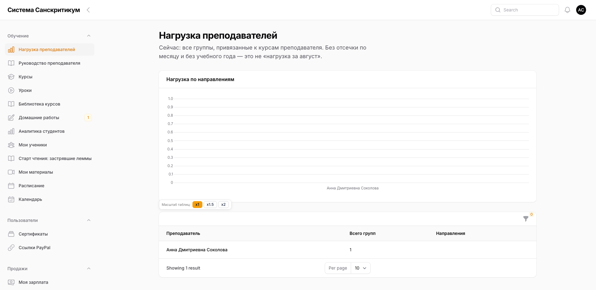

Сводка по занятости преподавателей. Служебный экран, только чтение — см.
[Посмотреть свою нагрузку](#посмотреть-свою-нагрузку-и-расчёты).

### Старт чтения: застрявшие леммы

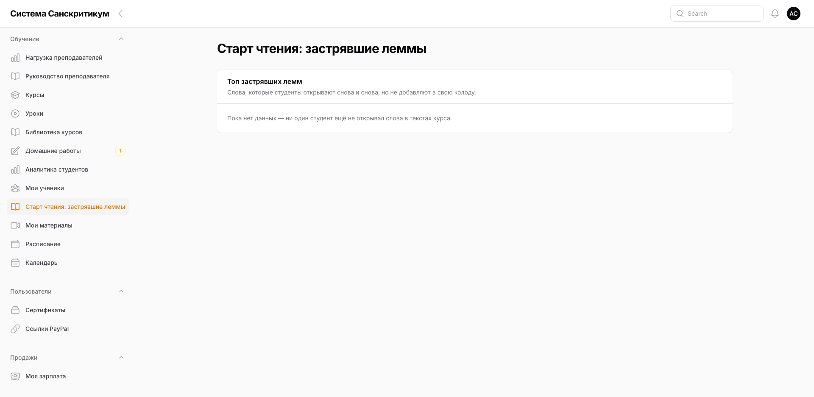

Узкий отчёт для когорты «Старт чтения»: слова, которые студенты раз за разом
смотрят в читалке, но так и не забирают себе в колоду. Если вы эту когорту не
ведёте, раздел вам не нужен — он просто виден.

### Руководство преподавателя

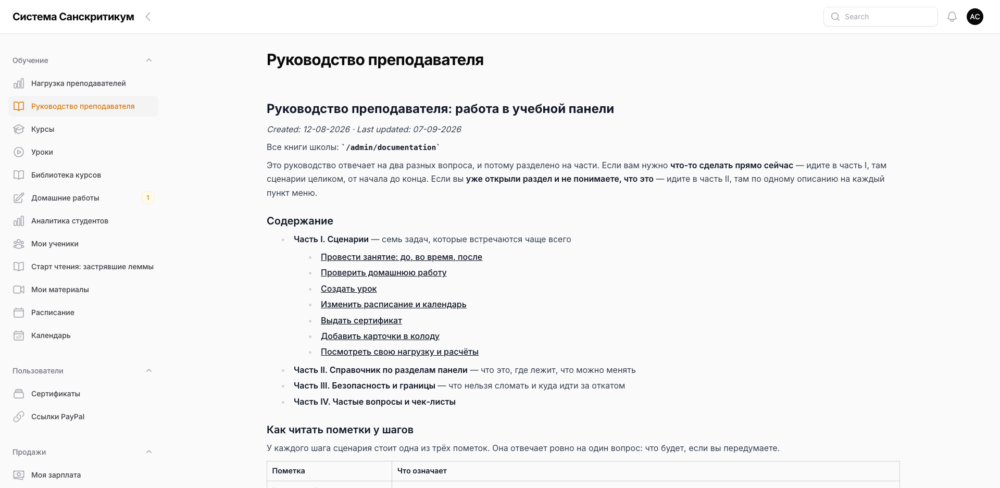

Этот самый текст, открытый прямо в панели. Он читается из репозитория школы, так
что версия здесь и версия в файле совпадают всегда.

### Посещаемость

Кто был на онлайн-встречах. Раздел для просмотра: он отвечает на вопрос «кто
дошёл до занятия», а не меняет ничего в оплатах или доступах.

Раздел включается отдельно и в вашем меню может отсутствовать — это не поломка.

## Пользователи

### Сертификаты

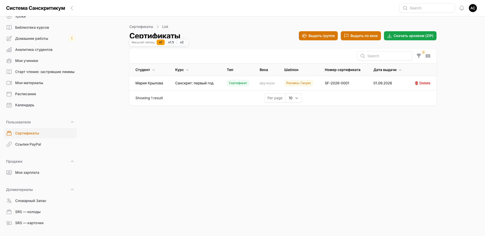

Выдача сертификатов выпускникам ваших курсов. Сценарий —
[Выдать сертификат](#выдать-сертификат). Обратите внимание: раздел лежит в группе
«Пользователи», а не в «Обучении».

## Допматериалы

### SRS — колоды

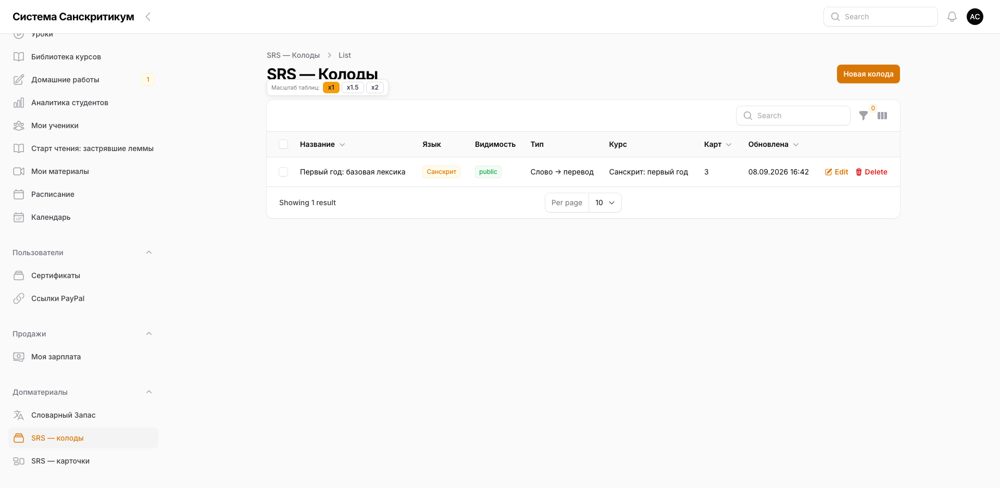

Колоды карточек для повторения: название, язык, видимость, состав. Сценарий —
[Добавить карточки в колоду](#добавить-карточки-в-колоду).

### SRS — карточки

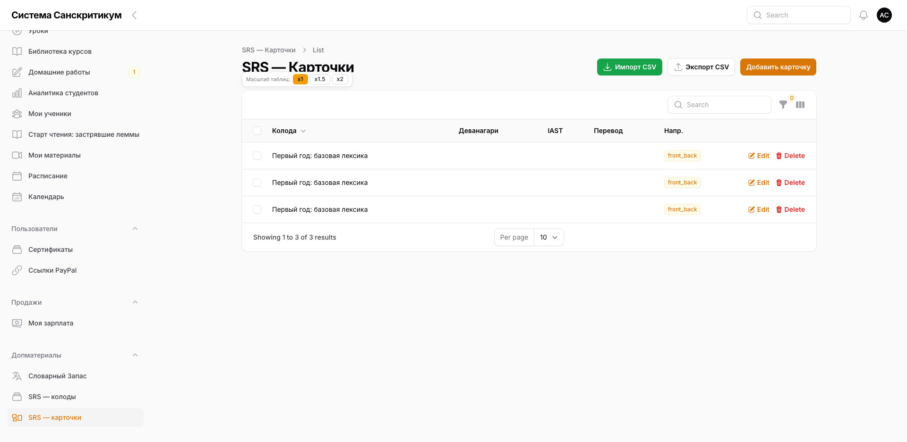

Все карточки списком, независимо от колоды. Здесь удобно править переводы пачкой,
а также импортировать и выгружать таблицу.

### Словарный запас

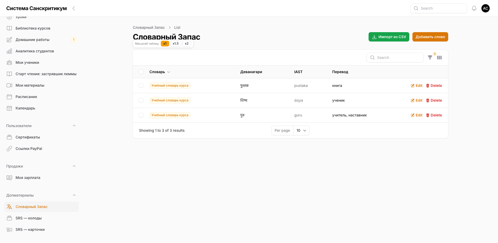

Каталог слов: написание, перевод, привязка к словарю. Слова можно связывать с
карточками. Сами словари-контейнеры заводит администратор, слова внутри — ваши.

## Продажи

### Моя зарплата

Кадр не снимается: на экране живые суммы. Откройте пункт **«Моя зарплата»** в
группе «Продажи».

Ваш расчёт за выбранный месяц: начислено, возвраты, выплачено, остаток. Чужих
преподавателей на странице нет. Записать выплату, выдать аванс или закрыть месяц
отсюда нельзя — это делает бухгалтер. Сценарий —
[Посмотреть свою нагрузку и расчёты](#посмотреть-свою-нагрузку-и-расчёты).

## Чего в вашем меню нет

Маркетинг, финансы школы, блог и служебные настройки вам не показываются вовсе —
не «показываются, но лучше не трогайте», а именно отсутствуют. Главная страница
панели тоже не ваша: после входа вас сразу уводит в рабочий раздел.

Свой расчёт зарплаты — в **«Моя зарплата»**. Цифры по оплатам студентов и
доступам — не спрятанная кнопка, а вопрос к администратору школы.

> **Если какой-то раздел из вашего меню вам по работе не нужен** — скажите
> администратору. Из одиннадцати пунктов «Обучения» ежедневных у большинства
> преподавателей шесть, и мы разбираемся с этим отдельно.

# Часть III. Безопасность и границы

## Что нельзя сломать и куда идти за откатом

Действия из этой таблицы либо видны студенту немедленно, либо не отменяются
вашими силами. Всё остальное в панели правится тем же экраном, которым было
создано.

| Действие | Что происходит | Откат |
|---|---|---|
| Выдать сертификат | У студента появляется файл с его именем | Отзыв — у администратора школы, затем повторная выдача |
| Опубликовать урок в оплаченном блоке | Студенты видят урок сразу | Уберите урок из блока или снимите публикацию курса |
| Изменить время занятия | Студент видит новое время, письма не будет | Верните время и напишите в чат курса |
| Изменить адрес страницы курса | Старые ссылки перестают открываться | Верните прежний адрес |
| Выключить «Доступен студентам» у курса | Курс исчезает из кабинетов даже у купивших | Включите обратно |
| Вернуть работу на доработку | Студенту уходит письмо с вашим комментарием | Решение переигрывается, но письмо уже ушло |
| Удалить материал урока | Файл пропадает у студентов | Загрузите заново, если он у вас сохранился |

Общее правило: **всё, что видно студенту, стоит проверить дважды до сохранения, а
не искать откат после**.

## Что преподаватель делать не может

Часть действий закрыта намеренно — это зона ответственности администратора.
Если что-то из списка нужно, попросите его.

| Действие | Кто делает |
|---|---|
| Создавать и удалять курсы | Администратор |
| Менять цены, тарифы и ставку преподавателя | Администратор |
| Назначать курс другому преподавателю | Администратор |
| Выдавать доступ группам вручную | Администратор — обычно это происходит по оплате автоматически |
| Видеть чужие курсы, учеников, оплаты и чужие зарплаты | Недоступно |
| Записать выплату или закрыть месяц | Бухгалтер |
| Общая статистика и финансы школы | Администратор |
| Отзывать выданный сертификат | Администратор |

Зато всё своё — наполнение уроков, материалы, домашние задания, расписание и
сертификаты своих курсов — вы ведёте полностью самостоятельно.

## Если сайт недоступен

Отдельная памятка на этот случай:
[TEACHER_SITE_DOWN_CHEATSHEET_RU.md](https://github.com/gasyoun/Systema-Sanscriticum/blob/main/docs/TEACHER_SITE_DOWN_CHEATSHEET_RU.md).
Коротко: занятие не отменяется, студентам пишем в чат курса, а о самом сбое
сообщаем администратору.

# Часть IV. Частые вопросы и чек-листы

## Частые вопросы

**Я вошёл, но разделы пустые.** Аккаунт не связан с карточкой преподавателя.
Напишите администратору.

**Почему у курсов нет кнопки «Создать»?** Курсы заводит администратор. Вы
наполняете уже существующий курс.

**Студент говорит, что не видит урок.** Проверьте блок урока и оплату студента по
этому блоку; если урок для конкретной группы — что студент в ней состоит.

**Не могу перетащить уроки, чтобы изменить порядок.** Выберите конкретный курс в
фильтре над таблицей.

**Как быстро повторить регулярное занятие?** В расписании нажмите
«Дублировать на +неделю» у существующего события.

**Я перенёс занятие — студентам придёт письмо?** Нет. Панель меняет время молча;
напишите в чат курса сами.

**Я ошибся в имени на сертификате.** Не выдавайте второй поверх первого:
попросите администратора отозвать ошибочный, затем выдайте новый.

**Почему в меню столько пунктов?** Групп у вас три, и все они учебные. Длинной
кажется группа «Обучение»: в ней одиннадцать пунктов, а ежедневных — шесть.
Разделов про продажи, маркетинг и финансы у вас нет вовсе.

**Мне не приходят письма о новых домашних работах.** Письмо уходит на почту
преподавателя, закреплённого за курсом. Проверьте у администратора, что почта
указана верно.

## Чек-лист: новый урок

- Выбран нужный курс, сверен номер потока
- Указаны блок и дата
- Добавлена ссылка на видео
- Загружены материалы
- При необходимости включено домашнее задание с условием
- Урок сохранён

## Чек-лист: проверка домашней работы

- Открыта работа со статусом «На проверке»
- Прочитан текст и просмотрены файлы студента
- Работа принята или возвращена на доработку с понятным комментарием
- Счётчик у «Домашних работ» уменьшился

## Чек-лист: перенос занятия

- Время события изменено
- Ссылка на встречу проверена
- Курс и группа у события не сбились
- Студентам написано в чат курса

Если вопрос выходит за рамки ваших курсов — цены, доступы, новые курсы,
технические сбои — это к администратору школы.

_Dr. Mārcis Gasūns_
