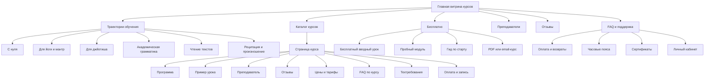

_Created: 21-06-2026 · Last updated: 05-09-2026_

# Как превратить samskrtam.ru в продающую витрину онлайн-курсов по санскриту

## Резюме для руководителя

Сейчас экосистема ОРС уже содержит почти всё сырье, из которого можно собрать сильную воронку продаж: большой тематический контент на `samskrtam.ru`, действующий каталог и личный кабинет на `samskrte.ru`, преподавательские биографии, бесплатные беседы и вводные материалы, а также подробный FAQ, который закрывает почти все типовые возражения ученика. Но в нынешнем виде эта система продает скорее **через ручное сопровождение и репутацию**, чем через ясную цифровую витрину: FAQ одновременно работает как справочник, SEO-хаб, каталог тем и посадочная страница; актуальные цены и расписание вынесены в «живые источники»; часть переходов ведет на отдельный домен; на части страниц есть неполные или конфликтующие сигналы доверия, включая разные юридические реквизиты и разные ценовые якоря. Всё это снижает конверсию даже при сильном академическом продукте. citeturn40view0turn36view0turn7view1turn8view0turn25view0turn26view0turn37search1turn37search9

Ключевая задача не в том, чтобы «сделать сайт красивее», а в том, чтобы **развести роли страниц**. FAQ должен остаться центром возражений и поискового трафика, но продажа должна происходить на нормальных страницах курсов с ясной программой, пробным уроком, преподавателем, ценой, FAQ по курсу, социальным доказательством и коротким путем до оплаты. Наиболее практичный сценарий — не миграция всей платформы, а **сборка нового слоя продаж поверх уже существующего каталога**, с унификацией контента, метрик и юридических блоков. citeturn40view0turn7view1turn8view0turn22search2turn22search5turn23search1

У Sanskritorium стоит заимствовать не дизайн как таковой, а несколько сильных продуктовых паттернов: понятные траектории обучения «с чего начать / изучать / углубиться», бесплатные вводные занятия как основной лид-магнит, маленькие группы и акцент на преподавателях, отдельные клубы и рассылку как слой удержания, а также очень ясную формулировку выгод для разных сегментов. Эти элементы хорошо адаптируются к русскоязычной аудитории ОРС, но должны быть соединены с более сильной операционной ясностью: актуальная цена, понятный старт, единый checkout, прозрачный доступ к записям и единые реквизиты. citeturn11view0turn14search2turn15search0turn15search3turn12view2

Если смотреть на рынок Европы и США, то курсы по санскриту чаще всего продаются по пяти моделям: короткие self-study продукты по произношению и деванагари; когортные академические курсы с Zoom и проверкой домашних заданий; узкие курсы для йога-аудитории; университетские или credit-bearing модули; и, отдельно, one-to-one/marketplace модель. Там явно видна одна закономерность: **чем сложнее и академичнее курс, тем детальнее страница продажи** — с syllabus, форматом, продолжительностью, преподавателем, сертификатом или кредитами, образцом материалов и ясной ценой. Именно этого сейчас сильнее всего не хватает ОРС на продающих страницах. citeturn20search0turn20search1turn16search8turn16search12turn21search0turn16search1turn27search4turn27search2turn30search2turn30search3

Практический приоритет на ближайшие 6–12 недель такой: сначала унифицировать структуру и доверие, затем собрать 3–5 эталонных страниц ключевых курсов, затем включить воронку «бесплатный вводный урок → email/Telegram-подогрев → страница курса → checkout → онбординг», и только после этого масштабировать SEO, ретаргетинг и эксперименты. citeturn40view0turn17search0turn14search2turn22search4turn34search7turn33search6

## Диагностика текущей структуры и точек потерь конверсии

По своей структуре страница FAQ на `samskrtam.ru/faq/` — это не просто FAQ. Она объединяет быстрые ссылки на Zoom/расписание/оплату/записи, большие тематические блоки для новичков, рубрикатор по типам курсов, большой раздел «Политика и поддержка», «живые источники», затем уже продающий блок «Курсы санскрита для русскоязычных», сегментацию по траекториям и квиз. То есть перед пользователем фактически не одна задача, а сразу пять: понять, что такое ОРС, почитать контент, сориентироваться по направлениям, решить оргвопросы и где-то между этим купить курс. С точки зрения SEO это богато; с точки зрения конверсии — перегружено. citeturn40view0turn36view0

При этом у страницы есть несколько сильных сторон. Во-первых, она очень хорошо закрывает реальные страхи и вопросы ученика: возраст, сложность, язык преподавания, часовые пояса, сертификат, записи, паузы, пробное занятие, оплата из-за рубежа, догоняние группы, размер группы и т. д. Во-вторых, у ОРС уже есть мощный тематический контент для верхней части воронки: статьи для йоги, джйотиша, мифологии, деванагари, тесты, разборы мантр и эпосов. Это отличная база для органического трафика и прогрева — ее не нужно создавать с нуля. citeturn36view0turn40view0

Главная проблема в том, что основной продающий путь недостаточно прямой. На FAQ цены и расписание явно вынесены в «живые источники», а покупка уводится дальше по ссылке на отдельный путь. Это удобно для операционного обновления данных, но создает лишнее переключение контекста: сначала контентный домен, потом каталог/кабинет на другом домене, потом выбор тарифа, потом логин/контакт с куратором. На практике это почти всегда режет конверсию у холодного трафика. citeturn40view0turn36view0turn6view0

Есть и явные сигналы доверия, которые сейчас работают против продажи. На FAQ указан ценовой якорь «от 400 ₽ за блок», тогда как в действующем каталоге блоки стоят, например, 3 000 ₽, 4 800 ₽ или 6 000 ₽, а целые курсы — 12 000 ₽ и выше. Для пользователя это выглядит как несостыковка или устаревшая информация. Дополнительно юридические реквизиты на разных страницах совпадают не везде: на `samskrte.ru` в каталоге фигурирует ИП Гасунс Марцис, а на части страниц `samskrtam.ru` и в политике/оферте фигурирует ИП Поликарпова Мария Михайловна; более того, даже в карточках курсов на старом домене встречаются оба варианта. Такое несоответствие у платного продукта — сильный конверсионный и репутационный риск. citeturn40view0turn7view0turn7view1turn25view0turn26view0turn37search1turn37search9turn37search10

Страницы курсов на `samskrte.ru` уже значительно ближе к продаже: там есть название, количество лекций, преподаватель, краткое описание, модульная цена, обещание бессрочного доступа к записям и указание, что занятия проходят в Zoom, а чат — в Telegram. Это хороший фундамент. Но критически важных блоков всё еще не хватает: подробного syllabus, ожидаемых результатов обучения, примеров уроков, отзывов, развернутого FAQ именно по этому курсу, видимой технической инструкции, понятного «кому подходит / кому не подходит», образцов материалов и явного позиционирования тарифов. На части форм бронирования и пробного занятия видны пустые суммы и не заполненные переменные, что выглядит как сломанный интерфейс. citeturn7view1turn7view0turn9view0turn36view1turn36view2

Отдельно я бы отметил фрикцию во входе: в каталоге явно написано, что если пользователь уже покупал курсы, ему не надо регистрироваться самостоятельно, а нужно писать куратору, чтобы аккаунт создали вручную. Это приемлемо как исключение для legacy-базы, но нельзя делать такой сценарий видимым и нормой для нового платящего пользователя. В продающей логике это означает: «даже после оплаты путь к курсу не полностью автоматизирован». Для теплой аудитории это терпимо; для масштабируемых онлайн-продаж — нет. citeturn7view0turn7view1

Мобильная композиция, глубина прокрутки, визуальная заметность CTA, плотность текста, длина форм, состояние меню и реальная нагрузка страницы без скриншотов и без аналитики остаются **неуточненными**. Это нужно добить отдельным UX-аудитом по скриншотам и данным веб-аналитики.

### Что сохранить

Сохранять стоит не только контент, но и саму логику экспертности. У ОРС уже есть сильные активы: академические и практические преподаватели, очень широкий предметный охват, бесплатные беседы и вебинары, преподавательские био-страницы, богатая статьяная база и сегментация по интересам. Это не «сайт с нуля», а уже достаточно зрелая экосистема, которой не хватает продуктовой упаковки. citeturn8view0turn37search0turn37search2turn37search3turn37search8turn40view0

### Что изменить в архитектуре страницы

Мой базовый вывод: текущий FAQ нужно **оставить как SEO- и support-хаб**, но перестать использовать его как главную продающую страницу. На уровне IA лучше выделить три отдельных класса страниц:

- контентный вход для поиска и прогрева;
- продающие страницы отдельных курсов и траекторий;
- help center / FAQ / policies / оргвопросы.

Это уберет смешение намерений и даст возможность измерять конверсию по каждому этапу отдельно. citeturn40view0turn33search1turn34search7

## Что именно добавить на сайт и как это упаковать

Ниже — практический список того, что нужно добавить или переработать, чтобы сайт начал не просто информировать, а системно продавать.

### Предлагаемая карта сайта



### Матрица контента

| Элемент | Зачем нужен | Рекомендуемый формат и объем | Что добавить у ОРС | Пример/ориентир | Приоритет |
|---|---|---|---|---|---|
| Страница курса | Основной коммерческий документ, заменяет «покупку через пояснения куратора» | 1 длинная лендинг-страница на курс: 1 500–3 000 слов, блоки-экраны, 1–2 CTA на экран | Для каждого флагманского курса: hero, кому подходит, чему научитесь, программа, формат, расписание, преподаватель, sample, отзывы, FAQ, цены, CTA | У OCHS и Yogic Studies каждая программа продается как самостоятельный продукт с курс-деталями, форматом, преподавателем, outline и ценой. citeturn16search8turn20search0turn18view0 | Критично |
| Syllabus / программа курса | Снимает страх «что именно будет» и помогает сравнить курсы | 6–16 модулей; на каждый модуль 3–7 тезисов | Указать темы, тексты, грамматику, навыки, домашние задания, expected outcomes | На страницах OCHS указан course outline, у Yogic Studies — модули и структура триместров. citeturn16search0turn16search8turn18view1 | Критично |
| Пример урока | Дает чувство формата до оплаты | 10–25 минут видео + конспект/PDF + 1 домашнее задание | Вынести вводные вебинары, которые уже есть, в структурированный sample-блок на каждой странице | ОРС уже публикует вводные занятия и вебинары, а Sanskritorium активно продает через бесплатные ознакомительные занятия. citeturn8view0turn41search0turn14search5 | Критично |
| Цены и тарифы | Убирает неопределенность и снижает нагрузку на кураторов | 3–4 тарифных карточки максимум | «Пробный урок», «Блок», «Полный курс», «Клуб/поддержка»; показать экономию при полной оплате | У ОРС уже есть модульная и полная оплата; Sanskritorium показывает цену за занятие и оплату блоками; Yogic Studies показывает one-time, instalments и bundle. citeturn7view0turn7view1turn14search2turn20search0turn20search1 | Критично |
| Отзывы | Социальное доказательство и снижение риска | 5–12 отзывов на курс; текст + имя + город + фото/аудио по возможности | Сделать общую библиотеку отзывов и отбирать 3–5 релевантных на каждой странице курса | На страницах Yogic Studies длинные отзывы встроены прямо в лендинг курса; у Sanskritorium есть отдельный раздел «Отзывы». citeturn18view1turn11view0 | Критично |
| Биографии преподавателей | Конвертируют авторитет в продажу | 400–800 слов + регалии + фото + видео-визитка 60–90 сек | Не просто «био», а «почему у этого человека стоит учиться именно этому курсу» | И у Sanskritorium, и у ОРС уже есть отдельные страницы преподавателей; их нужно связать с курсами и сократить до продающего формата. citeturn12view2turn37search0turn37search2turn37search3turn37search8 | Высоко |
| FAQ по курсу | Закрывает частные возражения прямо перед оплатой | 6–12 вопросов в accordion | Нужен на каждой странице курса: «можно ли новичку», «нужна ли деванагари», «что если пропускаю», «есть ли записи», «сколько времени в неделю» | Сильнейший FAQ у ОРС уже есть на центральной странице; его надо разрезать и раздать по страницам курсов. citeturn36view0turn40view0 | Высоко |
| Сертификаты | Уточняют ожидания и снимают юридический риск | 1 короткий блок + sample PDF | Писать честно: сертификат участия / прохождения, не документ об образовании; отдельно — если есть внутренняя аттестация, описать ее | OРС и Sanskritorium уже прямо пишут, что программы просветительские и не дают госдокументов; Yogic Studies выдает completion certificate, HUA — академические credits. citeturn8view0turn25view0turn15search3turn18view1turn21search0 | Высоко |
| Технические требования | Снижают число сбоев и обращений в поддержку | 150–250 слов + чек-лист | Zoom/браузер, Telegram, email, формат доступа к записям, часовые пояса, как получить пароль, как войти в кабинет | На страницах OРС и в оферте уже есть фрагменты техтребований, но они разбросаны. citeturn7view0turn25view0turn26view0 | Высоко |
| Оплата и запись | Самая важная операционная страница после лендинга | 1 короткий step-by-step экран + FAQ | Шаги: выберите тариф → оплатите → получите письмо → зайдите в ЛК → чат/Zoom | Сейчас путь размазан между FAQ, живыми источниками, каталогом и ручной связью с куратором. citeturn40view0turn7view0turn7view1 | Критично |
| SEO-копирайтинг | Дает входной органический трафик по намерению | 1 pillar + 3–5 supporting pages на кластер | Страницы-кластеры: «санскрит с нуля», «санскрит для йоги», «деванагари», «читать Бхагавадгиту в оригинале», «санскрит для джйотиша» | У OРС и Sanskritorium уже видны рабочие интенты: деванагари, йога, мантры, основы санскрита, история языка. citeturn40view0turn41search0turn13search3 | Критично |
| Лид-магниты | Собирают email до покупки | PDF, пробный урок, мини-курс, чек-лист | «С чего начать с санскрита за 7 дней», «Как читать деванагари без боли», «10 слов из йоги, которые вы наконец поймете» | Sanskritorium использует бесплатные вводные занятия и бесплатные курсы; Cambridge Sanskrit дает free video resources, handouts и sample chapters. citeturn41search0turn13search0turn31search3turn31search6 | Критично |
| Email-последовательности | Превращают интерес в продажу без ручного дожима | 5–7 писем на 10–14 дней | Серии под сегменты: новичок / йога / джйотиш / академический трек | Kajabi делает email-маркетинг частью продуктовой платформы; Sanskritorium собирает подписку на рассылку. citeturn22search4turn15search0 | Высоко |
| Модели ценообразования | Позволяют монетизировать разные мотивации и бюджеты | 3–5 моделей максимум | Разовый микро-продукт, блок, полный курс, bundle по траектории, клуб/подписка | Thinkific прямо поддерживает courses + communities + memberships + order bumps; Yogic Studies и Sanskrit Shiksha продают bundles; OРС уже продает блоками и целиком. citeturn22search2turn22search3turn20search0turn20search1turn29search2turn7view0turn7view1 | Высоко |
| Мультимедиа | Повышают понимание формата и удержание | Видео, аудио, транскрипт, PDF-конспект, captions | Для каждого курса: teaser 60–90 сек, sample lesson, 1 аудиофайл, 1 транскрипт, 1 PDF-пример | OCHS сочетает video + audio + course notes; Yogic Studies — video + audio + workbook; ASI — text + audio; SanskritSense — видеоуроки и previews. citeturn16search0turn18view0turn16search1turn27search4 | Высоко |

### Пример SEO-копии для ключевых страниц

Для страниц верхнего уровня я бы использовал не абстрактные названия, а названия под намерение поиска и под сегмент.

| Страница | H1 | SEO-title | Meta description |
|---|---|---|---|
| Траектория для новичков | Санскрит с нуля онлайн | Санскрит с нуля онлайн — курс для начинающих на русском | Начните изучать санскрит с нуля: деванагари, произношение, базовая грамматика, живые занятия и записи. |
| Йога-сегмент | Санскрит для йоги и мантр | Санскрит для йоги — мантры, асаны, произношение, тексты | Для преподавателей и практиков йоги: понимание терминов, мантр и первоисточников без эзотерической воды. |
| Деванагари | Как научиться читать деванагари | Деванагари онлайн — как читать и писать санскритское письмо | Бесплатный вводный урок, курс по письму и чтению, примеры, тест и запись онлайн. |
| Филология | Грамматика санскрита онлайн | Грамматика санскрита онлайн — курс по Кочергиной и чтению текстов | Академический курс на русском: алфавит, склонения, спряжения, чтение и разбор текстов. |
| Джйотиш | Санскрит для джйотиша | Санскрит для джйотиша — термины, тексты и произношение | Для астрологов и интересующихся индийской астрологией: базовые термины, чтение и понимание первоисточников. |

Эти формулировки согласуются с тем, как уже ищут и продают подобные продукты сами ОРС, Sanskritorium и другие школы: через «с нуля», «деванагари», «для йоги», «основы санскрита», «чтение текстов», а не через слишком внутренние названия. citeturn40view0turn41search0turn13search3turn20search1

### Пример макета страницы курса

```text
┌──────────────────────────────────────────────────────────────────────┐
│ ХЛЕБНЫЕ КРОШКИ: Главная / Курсы / Грамматика санскрита              │
├──────────────────────────────────────────────────────────────────────┤
│ H1: Грамматика санскрита с нуля                                     │
│ Подзаголовок: От деванагари до чтения простых текстов               │
│ [Кнопка: Записаться] [Кнопка: Смотреть пробный урок]                │
│ Микродоверие: 20+ лет школы • записи занятий • русскоязычно         │
├──────────────────────────────────────────────────────────────────────┤
│ Блок: Для кого курс                                                 │
│ - абсолютный новичок                                                │
│ - практик йоги                                                      │
│ - филолог/лингвист                                                  │
├──────────────────────────────────────────────────────────────────────┤
│ Блок: Чему вы научитесь                                             │
│ - читать деванагари                                                 │
│ - понимать базовую грамматику                                       │
│ - разбирать простые шлоки                                           │
├──────────────────────────────────────────────────────────────────────┤
│ Блок: Программа по модулям                                          │
│ Модуль 1 … Модуль 2 … Модуль 3 …                                    │
├──────────────────────────────────────────────────────────────────────┤
│ ВИДЕО: 12–15 минут sample lesson                                    │
│ + PDF-конспект + домашнее задание                                   │
├──────────────────────────────────────────────────────────────────────┤
│ Преподаватель                                                       │
│ Фото + 5–7 строк «почему именно этот человек ведет этот курс»       │
├──────────────────────────────────────────────────────────────────────┤
│ Тарифы                                                              │
│ Пробный урок | Блок | Полный курс | + клуб/чат                      │
├──────────────────────────────────────────────────────────────────────┤
│ Отзывы + кейсы                                                      │
│ 3 текстовых + 1 аудио/видео                                         │
├──────────────────────────────────────────────────────────────────────┤
│ FAQ по курсу                                                        │
│ Можно ли без деванагари? Есть ли записи? Сколько времени?           │
├──────────────────────────────────────────────────────────────────────┤
│ Техтребования + как проходит оплата                                 │
│ Zoom/Telegram/email/личный кабинет                                  │
├──────────────────────────────────────────────────────────────────────┤
│ Финальный CTA                                                       │
│ [Записаться] [Задать вопрос куратору]                               │
└──────────────────────────────────────────────────────────────────────┘
```

## Что заимствовать у Sanskritorium и как адаптировать под ОРС

Sanskritorium особенно силен не «дизайном», а тем, что уже на уровне главной страницы человек быстро понимает: **куда ему идти, если он новичок, если ему нужна грамматика, если его интересуют тексты, если он хочет что-то бесплатное и если он хочет принадлежать к сообществу**. У них это собрано в траектории «Начать / Изучать / Углубиться», отдельные бесплатные курсы, в записи, клубы, преподаватели, статьи и FAQ. Для русскоязычного рынка это очень рабочая схема, потому что санскрит почти никогда не покупают «в лоб» — его покупают после когнитивного объяснения, с какого входа начинать. citeturn11view0turn13search1turn13search4turn15search0

### Конкретные элементы для заимствования

| Что у Sanskritorium работает | Почему это важно | Как адаптировать для ОРС |
|---|---|---|
| Траектории обучения вместо одного плоского каталога | Сокращают выбор и дают ученику чувство направления | На главной витрине ОРС сделать не «все курсы подряд», а 5–6 входов: «С нуля», «Йога и мантры», «Джйотиш», «Грамматика», «Чтение текстов», «Рецитация». citeturn11view0turn41search0 |
| Бесплатные вводные занятия | Это лучший лид-магнит в такой нише | Перестать прятать вводные занятия в архивах и начать продавать ими каждый курс: «смотрите 15 минут» или «придите на бесплатный вводный Zoom». citeturn11view0turn41search0turn8view0 |
| Малые группы и индивидуальный подход | Это мощная антипод-обещалка против массовых платформ | Если у конкретного курса группа небольшая, это надо писать на странице курса; если нет — не обещать. У Sanskritorium прямо указаны малые группы 5–9 человек и бесплатная индивидуальная консультация. citeturn15search0 |
| Ясная аргументация «почему именно мы» | Переводит экспертность в понятную выгоду | У OРС этот блок должен быть не общим, а конкретным: академический уровень, русскоязычное обучение, живые учителя, записи, сильные тексты, огромная корпусная база. У Sanskritorium этот блок уже формализован через методы, преподавателей, размер групп, домашнюю работу. citeturn15search0turn24search0 |
| Клубы и community layer | Дают retention и повторные продажи | OРС логично сделать «Клуб чтения», «Клуб мантр и рецитации», «Клуб вопросов по грамматике», возможно с ежемесячной подпиской. У Sanskritorium клубы вынесены как отдельный продуктовый слой. Thinkific и Kajabi прямо поддерживают communities и memberships. citeturn11view0turn22search0turn22search1turn22search3 |
| Рассылка как owned-channel | Снижает зависимость от соцсетей и мессенджеров | У OРС контентная база уже позволяет собирать email-лиды по интересам: йога, джйотиш, деванагари, академический путь. У Sanskritorium рассылка встроена в сайт. citeturn15search0turn22search4 |
| Учитель как бренд | В нише санскрита решение часто принимают под преподавателя, а не под школу | У OРС это уже почти готово: био-страницы преподавателей есть. Нужно добавить короткие продающие версии, видео-визитки и списки курсов каждого преподавателя. citeturn37search0turn37search2turn37search3turn37search8turn12view2 |

### Что не копировать буквально

Sanskritorium сейчас часто ведет на внешние формы записи, и это хорошо работает для их операционной модели, но для OРС я бы не делал ставку на множество отдельных форм как на основную логику checkout. Для роста продаж вам нужен **единый сценарий**: интерес → страница курса → выбор тарифа → оплата → авто-письмо → доступ. Внешняя форма годится как лид-магнит; для основной продажи она слишком рыхлая. citeturn11view0turn14search2turn22search2

### Адаптация под российскую аудиторию и текущую правовую рамку

Под русскоязычную аудиторию имеет смысл сохранить честную просветительскую рамку и не обещать того, что юридически не обеспечивается лицензией: дипломов, квалификаций, «официального образования». Этому соответствует и текущая позиция OРС, и формулировки Sanskritorium. Но внутри этой рамки можно и нужно сильно улучшать доверие: единая оферта, единый оператор персональных данных, единый set реквизитов, единая формулировка про сертификат участия, понятный возврат, понятный доступ к записям и единая техинструкция. Сейчас сам сайт OРС демонстрирует, как даже хорошие юридические документы теряют пользу, если на соседних страницах реквизиты и цена расходятся. citeturn8view0turn25view0turn26view0turn37search1turn37search9turn7view0

## Как продаются курсы по санскриту в Европе и США

На англоязычном и западном рынке видно несколько устойчивых моделей монетизации.

Первая — **короткие self-study продукты**. Здесь продают произношение, деванагари, мантры, начальный словарь или профессионально определенную нишу вроде yoga Sanskrit. Такие продукты обычно стоят от очень дешевых entry-level цен вроде $24.99 за курс по произношению до $90–175 за более полный self-study курс с lifetime access, workbook и аудио. Основная механика продажи — ясная специальизация, низкий риск, вечный доступ и sample previews. citeturn27search4turn20search1turn18view2

Вторая — **когортные или полу-когортные академические программы**. Они уже продаются как серьезное обучение: по 8–12 недель, с Zoom-сессиями, weekly coursework, материалами по главам, домашними заданиями, иногда промежуточной и финальной проверкой. Здесь цены выше: примерно £275 за восьминедельный курс в OCHS, $375 за один триместр на Yogic Studies, $200–350 за короткий credit-bearing модуль в HUA. В таких программах обязателен очень подробный syllabus, фигура преподавателя и понятное ожидание по нагрузке. citeturn16search8turn16search0turn16search12turn20search0turn21search0turn21search3

Третья — **нишевые продукты под йога-аудиторию**. Здесь часто обещают не «классическую филологию», а конкретную практическую пользу: понимать асаны, мантры, сутры, произносить правильно, читать ключевые термины без академической тяжести. Именно в этой модели чаще встречаются сертификаты completion и даже CE credits для Yoga Alliance. Это очень важный сигнал: западная йога-аудитория гораздо лучше реагирует на компактную прикладную упаковку, чем на обещание «изучать язык несколько лет». citeturn20search1turn18view0turn18view2turn17search7

Четвертая — **университетская или credit-bearing модель**. HUA показывает, что часть рынка готова покупать не просто курс, а модуль с кредитами, обязательной посещаемостью и без записи. Это уже совсем другой сегмент ожиданий: там ценность не в вечном доступе, а в структуре, дисциплине и институциональном признании. Для OРС это не приоритет на старте, но это хороший ориентир для premium-линии или партнерств с образовательными организациями. citeturn21search0turn21search3turn21search4

Пятая — **one-to-one и marketplace-модель**. Площадки вроде Preply или Open Pathshala продают гибкость, индивидуализацию и покупку «урока», а не «курса». Это значит, что часть рынка не хочет входить в длинный академический трек; она хочет быстрый личный формат, оплата по урокам, гибкий график и понятный hourly pricing. Для OРС это аргумент в пользу как минимум одного premium-тарифа «куратор/наставник» или мини-группы, даже если массово школа остается групповой. citeturn30search2turn30search3

### Что видно по каналам привлечения

По публичным страницам сильнее всего заметны следующие каналы:

- SEO и контент-маркетинг: почти все заметные игроки строят тематические страницы, learning pathways, статьи, resource hubs и посадочные под поисковое намерение. citeturn40view0turn16search12turn13search1turn31search3turn31search6
- Бесплатные вводные занятия, вебинары и preview-уроки: это доминирующий лид-магнит. citeturn41search0turn8view0turn20search1
- Авторитет преподавателя и институции: PhD, университеты, исследовательская практика, академические книги, опыт преподавания. citeturn18view1turn16search0turn21search0turn12view2
- Сообщество и удержание: communities, clubs, private forums, memberships, рассылки. citeturn22search0turn22search1turn15search0turn17search4
- Партнерства с йога-средой и continuing education: особенно у курсов для практиков йоги. citeturn20search1turn17search7

Надежных публичных следов активного paid-media бюджета у большинства игроков я не увидел; внешне рынок выглядит как рынок, который в основном продает через **органику, экспертный бренд, комьюнити и вебинары**, а не через агрессивный performance-only подход.

### Что ожидают от сертификатов и credentialing

Здесь рынок сегментирован. В нише йоги и самостоятельного онлайн-обучения сертификат completion — нормальный и ожидаемый бонус. В более академических и институциональных форматах ценятся либо credits, либо явная принадлежность к университету/центру. Во многих случаях, как и у OРС, курс честно позиционируется как просветительский, без присвоения квалификации. Значит, для OРС правильная стратегия — не пытаться «придумать диплом», а сделать прозрачную лестницу: **сертификат участия / внутренний зачет / возможно, позже партнерский академический модуль**. citeturn8view0turn25view0turn18view1turn21search0turn29search2

### Сравнительная таблица конкурентов и ориентиров

Ниже — не только «чисто западные» игроки, но и международные провайдеры, которые продают в англоязычные рынки и формируют ожидания аудитории Европы/США.

| Игрок / курс | Страна | Цена | Формат | Платформа | Целевая аудитория | Сильная сторона | Источник |
|---|---|---:|---|---|---|---|---|
| Oxford Centre for Hindu Studies — Sanskrit Level 1 | Великобритания | £275 | 8 недель, on-demand + 4 Zoom | Собственная LMS | Новички и возвращающиеся студенты | Четкий pathway, lifetime access, 7-day money-back guarantee | citeturn16search8turn16search12 |
| Oxford Centre for Hindu Studies — Sanskrit Level 7 | Великобритания | £275 | 8 недель, on-demand + live Zoom | Собственная LMS | Продолжающие | Продвинутый уровень, audio + notes + Zoom, читается как серьезная программа | citeturn16search0 |
| Yogic Studies — SKT 101 Elementary Sanskrit I | США | $375 | 12 недель, 2 live Zoom в неделю + записи | Собственный сайт / LMS | Серьезные начинающие | Полный академический трек, 24 live sessions, сертификат, CE credits, bundle 101–103 | citeturn20search0turn18view1 |
| Yogic Studies — Sanskrit for Yogis | США | $175 | Self-study, lifetime access | Собственный сайт / LMS | Йога-преподаватели и практики | Прикладной угол: асаны, сутры, шлоки; workbook + audio + community forum | citeturn20search1turn18view0 |
| Yogic Studies — Devanāgarī Seminar | США | $90 | Self-study, 15 часов | Собственный сайт / LMS | Полные новички | Очень низкий порог входа, bundling с Sanskrit for Yogis | citeturn18view2turn30search5 |
| Hindu University of America — Introduction to Sanskrit Sounds | США | $200–350 | Online live-only, 2 intensives / weekends | Собственный сайт / WooCommerce-like checkout | Новички, ищущие структуру | 2 credits, attendance mandatory, четкие learning objectives | citeturn21search0 |
| American Sanskrit Institute — Atlas Courses | США | от $75; downloadable versions $65 | Downloadable / self-study | Собственный e-commerce | Самоучки, текстоцентричная аудитория, yoga text readers | Упор на текст + аудио + word-by-word explanation + Sanskrit Atlas | citeturn16search1turn16search3turn16search5 |
| SanskritSense — Complete Sanskrit Pronunciation | Международный | $24.99 | Self-study video course | Thinkific | Произношение, chanting, hobbyists | Очень понятный micro-offer, previews, дешевый вход, большая lesson-based структура | citeturn27search4turn38search2 |
| SanskritSense — Sanskrit Chanting Mastery | Международный | $89 | Self-study + assignments/feedback элементы | Thinkific | Практики рецитации и chanting | Узкая специализация и модульно-урочная структура | citeturn27search4turn38search1 |
| Shakiri — Sanskrit School | Австрия | €299 | Online course + 1 live session | Собственная платформа | Йога, Индия, мантры, язык | Хорошее европейское позиционирование для yoga/wellness сегмента | citeturn27search2 |
| Open Pathshala — Learn Sanskrit Online | Международный | $15/класс при пакете, $18/класс без пакета | Live weekly class | Собственный сайт | Нужна гибкость и покупка по урокам | Урок как единица продажи, часы не сгорают, гибкое расписание | citeturn30search2 |
| Sanskrit Shiksha — Foundations / pathway | Международный | от $29; bundle $69; full pathway $129 | Live online + recordings | Собственный сайт | Международные новички | Сверхпонятный pricing ladder, сертификаты, pathway-upgrade | citeturn27search0turn29search2 |

### Что это означает для ценовой логики ОРС

Для OРС не нужно искусственно занижать цену до уровня массовых международных микро-продуктов. Но нужно ясно разделить три уровня предложения:

- **входной продукт**: дешевый и безопасный шаг, например пробный урок / мини-курс / вводный модуль;
- **основной курс**: модульно или целиком, с понятной выгодой полной оплаты;
- **retention layer**: клуб, клуб чтения, разговорная практика, поддержка, архив, закрытые вебинары.

Это соответствует и текущей модульной логике ОРС, и тому, как платформы вроде Thinkific/Kajabi рекомендуют объединять курсы, сообщества, memberships и order bumps. citeturn7view0turn7view1turn22search2turn22search3turn22search1

### Какие платформы действительно типичны и что выбирать ОРС

Платформенный ландшафт выглядит так:

- **Thinkific** — силен для courses + communities + memberships + order bumps. Хорош, если хотите быстро собрать коммерческий учебный бизнес с клубом и bundled-логикой. citeturn22search0turn22search2turn22search3
- **Kajabi** — силен как all-in-one: emails, offers, communities, monetization в одной системе. Хорош для creator-led школы с акцентом на маркетинг. citeturn22search1turn22search4
- **Teachable** — силен для быстрой продажи онлайн-курсов, мобильного доступа, graded quizzes, certificates, upsells и referrals. citeturn22search5
- **Moodle** — силен там, где нужна высокая кастомизация, собственный контроль, сложная LMS-логика и сертификаты/верификация через плагины. Это скорее выбор для более институционального сценария. citeturn23search1turn23search6turn23search10

Для OРС мой практический вывод такой: **не начинать с миграции платформы**. Сначала собрать нормальную коммерческую архитектуру и измеримость поверх существующей связки. Если затем понадобится подписка, клубы и быстрые промостраницы без тяжелой кастомной разработки, тогда уже смотреть на Thinkific/Kajabi. Moodle имеет смысл только в будущем институциональном/сертификационном сценарии.

## Дорожная карта запуска и измерения

### Воронка, которую стоит строить

```mermaid
flowchart LR
    A[SEO-статья / видео / соцсеть / рекомендация] --> B[Лид-магнит]
    B --> C[Email / Telegram-подогрев]
    C --> D[Страница конкретного курса]
    D --> E[Пробный урок или sample]
    E --> F[Выбор тарифа]
    F --> G[Оплата]
    G --> H[Письмо и личный кабинет]
    H --> I[Первое занятие]
    I --> J[Апселл в следующий блок / клуб / bundle]
```



### План на десять недель

| Неделя | Цель | Что делаем | Кто нужен | KPI этапа |
|---|---|---|---|---|
| Первая | Свести хаос в одну схему | Контент-инвентаризация: FAQ, статьи, курсы, био, записи, старые product pages, юридические тексты; список конфликтов по цене, структуре и реквизитам | Руководитель проекта + контент-редактор + техспец | Один master-sheet активов и конфликтов |
| Вторая | Восстановить доверие | Утвердить единый оператор, единые реквизиты, единый текст про сертификаты, единый pricing-source, единый путь после оплаты | Руководитель + юрист/операционный консультант + разработчик | Убраны конфликтующие реквизиты и price anchors |
| Третья | Собрать шаблон продающей страницы | Дизайн/прототип эталонной course page и шаблон блока «преподаватель / программа / FAQ / sample / тарифы» | UX-дизайнер + контент + разработчик | Утвержден один reusable template |
| Четвертая | Запустить первые флагманы | Собрать 3 страницы: «санскрит с нуля», «санскрит для йоги», «грамматика/тексты» | Контент-редактор + дизайнер + разработчик + куратор | 3 страницы опубликованы |
| Пятая | Включить лидогенерацию | Сделать 2 лид-магнита: бесплатный вводный урок и PDF/email-гид; формы захвата и авто-ответ | Контент + email-маркетолог + разработчик | CR в lead capture не ниже внутренней целевой нормы |
| Шестая | Настроить аналитику | GA4 ecommerce/events, Yandex Metrica, Session Replay / heatmaps, разметка форм и checkout steps | Аналитик / GTM-специалист | Видны события `view_course`, `sample_play`, `lead_submit`, `begin_checkout`, `purchase` |
| Седьмая | Включить прогрев | Серии писем для 3 сегментов: новичок, йога, академический трек | Email-маркетолог + редактор | Open/click baseline и первые продажи из email |
| Восьмая | Убрать ручную фрикцию | Автоматизировать welcome-email, доступы, письма с инструкцией, сокращение ручных касаний куратора | Разработчик + операционный менеджер | Меньше запросов «как войти / где ссылка / где пароль» |
| Девятая | Запустить первые эксперименты | A/B тест первого экрана, CTA, цены, proof-блоков, порядка секций | Аналитик + UX + разработчик | Не менее 2–3 корректно измеряемых тестов |
| Десятая | Масштабировать | Построить content calendar и ретаргетинг только на уже прогретый трафик | Контент-маркетолог + performance-специалист | Рост lead volume и стабилизация purchase funnel |

### Минимальный набор ресурсов

Для такого проекта не нужен большой штат, но нужна четкая связка ролей:

- владелец продукта / академический редактор;
- контент-редактор;
- UX/UI-дизайнер;
- frontend/CMS-разработчик;
- аналитик/GTM-специалист;
- email-маркетолог;
- операционный куратор.

Если ресурсы ограничены, первые четыре недели можно сделать и более компактной связкой: владелец + один сильный контент-продюсер + один разработчик + один аналитик на part-time.

### Что именно измерять

Для сайта OРС я бы ставил не только финальную покупку, но и промежуточные события, потому что продукт дорогой по когнитивному усилию. GA4 и Yandex Metrica прямо поддерживают событийную и ecommerce-логику, а Clarity / Session Replay помогают увидеть, где люди реально застревают на форме или лендинге. citeturn33search1turn33search3turn33search5turn33search6turn34search0turn34search7turn34search8turn32search0

**Обязательные события:**

- `view_course_page`
- `sample_lesson_play`
- `teacher_bio_click`
- `faq_expand`
- `lead_magnet_submit`
- `quiz_complete`
- `begin_checkout`
- `add_to_cart` или выбор тарифа
- `purchase`
- `refund_request`
- `join_first_live_session`

GA4 требует корректно настроенных ecommerce events вроде `add_to_cart`, `begin_checkout` и `purchase`, иначе данные не попадут в ecommerce-отчеты; purchase funnel потом можно отслеживать и в стандартном Purchase Journey report. Yandex Metrica дополнительно полезна здесь как сочетание ecommerce-отчетов, Session Replay и карт кликов/скролла. citeturn33search3turn33search5turn33search6turn34search0turn34search4turn34search7turn34search10

### Основные метрики конверсии

Удобно разделить метрики на три слоя.

**Метрики внимания**

- CTR с контентных страниц на страницы курсов
- глубина скролла до блока тарифов
- процент просмотра sample lesson
- процент открытия FAQ-блока на course page

**Метрики намерения**

- конверсия в лид из лид-магнита
- конверсия квиза в просмотр рекомендованного курса
- конверсия course page в `begin_checkout`
- количество вопросов куратору на 100 просмотров страницы

**Метрики денег и удержания**

- конверсия `begin_checkout → purchase`
- выручка на лида
- доля продаж полного курса vs блоков
- апселл из одного курса в следующий
- доля возвратов
- retention в клуб/сообщество

Для OРС я бы считал успехом на первом этапе не «идеальные отраслевые бенчмарки», а достижение **внутренне согласованной и измеряемой воронки без сломанных переходов и противоречивых сигналов доверия**.

### Какие A/B тесты запускать первыми

Вот тесты, которые имеют смысл почти сразу после внедрения новой архитектуры:

| Тест | Вариант A | Вариант B | Главная метрика |
|---|---|---|---|
| Первый экран страницы курса | Академический угол | Практический угол | CTR в sample / begin checkout |
| Главный CTA | «Записаться» | «Смотреть пробный урок» | `begin_checkout` и lead capture |
| Порядок блоков | Программа выше преподавателя | Преподаватель выше программы | Scroll to pricing / lead-to-purchase |
| Блок цены | Только блоки | Блоки + целый курс + экономия | Доля выбора полного курса |
| Social proof | Текстовые отзывы | Текст + короткие аудио/видео | `begin_checkout` |
| FAQ | Обычный accordion | FAQ + микроответы рядом с ценой | Drop-off до checkout |
| Лид-магнит | Бесплатный вводный Zoom | PDF-гид + письмо-цепочка | Lead capture CR |
| Сегментированный вход | Общая course page | Отдельная version для йоги / новичков | Conversion to checkout |

Сам метод A/B-тестирования уместен именно здесь: веб-эксперименты измеряют, какая версия страницы лучше достигает конверсионной цели, а инструменты вроде Optimizely специализируются на случайном разбиении трафика и сравнении вариаций. Если трафика немного, вместо параллельных тестов лучше идти волнами и сначала тестировать **самые крупные рычаги**: ценовой экран, CTA и порядок смысловых блоков. citeturn35search2turn35search3

## Список ключевых источников

Ниже — основные первичные источники, на которых базировался разбор. Я намеренно отдавал приоритет официальным страницам школ, страницам курсов и документации платформ.

```text
https://samskrtam.ru/faq/
https://samskrte.ru/
https://samskrte.ru/online
https://samskrte.ru/online/kursy/grammatika-po-kocerginoi-gr62
https://samskrte.ru/online/kursy/kasmirskii-sivaizm-cast-2-2026
https://samskrtam.ru/oferta/
https://samskrtam.ru/privacy-policy/
https://samskrtam.ru/product/osnovy-ayurvedy/
https://samskrtam.ru/product/reczitacziya-gimna-guru-stotram/
https://samskrtam.ru/mg/
https://samskrtam.ru/usha/
https://samskrtam.ru/vanya/
https://www.sanskritorium.ru/
https://www.sanskritorium.ru/kursy/
https://www.sanskritorium.ru/kursy/osnovy-sanskrita/
https://www.sanskritorium.ru/kursy/obzornyj-kurs-sanskrita/
https://www.sanskritorium.ru/faq/
https://www.sanskritorium.ru/prepodavateli/
https://ochsonline.org/learning-pathways-sanskrit/
https://ochsonline.org/course/sanskrit-level-01-2026-cohort/
https://ochsonline.org/course/sanskrit-level-7-2025-cohort/
https://www.yogicstudies.com/skt-101
https://www.yogicstudies.com/skt-100b
https://www.yogicstudies.com/skt-100a-old
https://www.hua.edu/product/introduction-to-sanskrit-sounds/
https://www.hua.edu/product/introducing-the-sounds-and-script-of-sanskrit-i/
https://www.americansanskrit.com/shop/atlas-courses
https://www.americansanskrit.com/shop/verb-conjugations-atlas-course-downloadable
https://sanskritsense.thinkific.com/
https://sanskritsense.thinkific.com/courses/scopy-of-complete-sanskrit-pronunciation-devanagari
https://sanskritsense.thinkific.com/courses/sanskrit-chanting-mastery
https://www.shakiri.at/start/online-ausbildungen/sanskrit-school/
https://openpathshala.com/learn-sanskrit-online
https://sanskrit-shiksha.com/
https://learn.vedicmathschool.org/product/sanskrit-online-classes/
https://preply.com/en/classes/sanskrit
https://www.cambridge-sanskrit.org/
https://www.cambridge-sanskrit.org/video-resources/
https://www.cambridge-sanskrit.org/other-resources-links/
https://support.thinkific.com/hc/en-us/articles/9942695724695-An-Introduction-to-Selling-Thinkific-Learning-Products
https://support.thinkific.com/hc/en-us/articles/7265849758999-Thinkific-Communities
https://support.thinkific.com/hc/en-us/articles/9995366884503-Selling-Strategies-for-Monetizing-your-Community
https://kajabi.com/features/email-marketing
https://www.kajabi.com/product/communities
https://www.teachable.com/online-courses
https://moodle.com/
https://moodle.org/plugins/tool_certificate
https://moodle.org/plugins/pluginversions.php?plugin=mod_customcert
https://support.google.com/analytics/answer/12200568
https://support.google.com/analytics/answer/12924131
https://support.google.com/analytics/answer/13128171
https://yandex.com/support/metrica/en/ecommerce/about
https://yandex.com/support/metrica/en/user-cases/online-store
https://yandex.ru/support/metrica/en/reports/ecommerce
https://clarity.microsoft.com/
https://support.optimizely.com/hc/en-us/articles/4410288109197-Get-started-with-Optimizely-Web-Experimentation
https://support.optimizely.com/hc/en-us/articles/38994812617357-Optimizely-Experiment-Results-page
```

## Итоговая рекомендация

Если сформулировать решение в одной фразе, то OРС нужно перестать продавать курсы как «сеть полезных ссылок с ручным сопровождением» и начать продавать их как **понятные образовательные продукты** с ясной траекторией, доказательством качества и безоперационным путем до оплаты. Базовый интеллектуальный капитал у вас уже есть; в ближайшие недели ценность даст не расширение ассортимента, а **упаковка, унификация и измеримость**. citeturn40view0turn8view0turn41search0turn20search0turn16search12

_Dr. Mārcis Gasūns_
